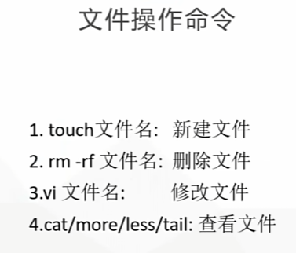
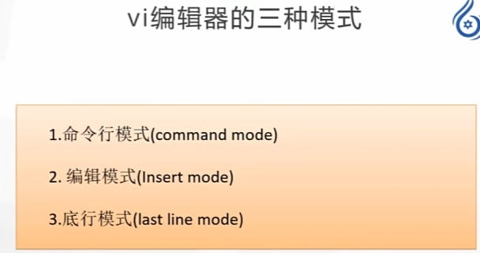
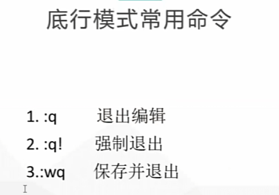
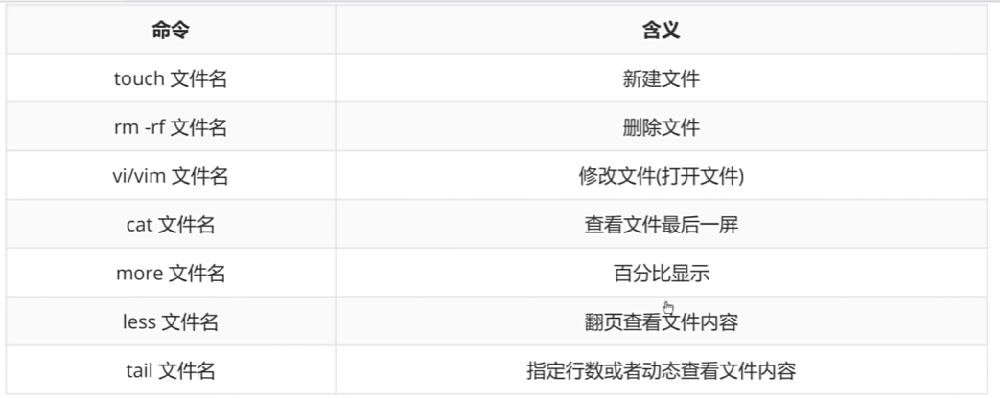
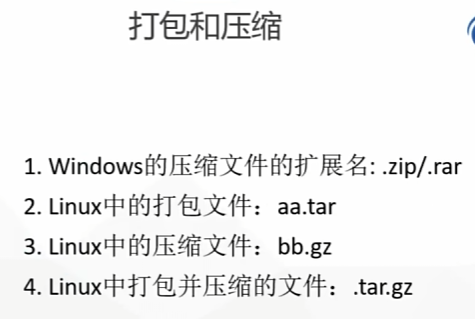
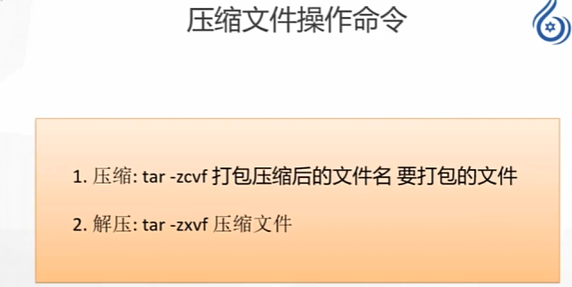
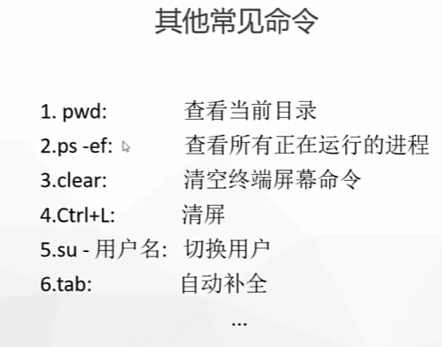
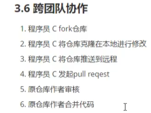

# **<mark>Linux基础命令</mark>**

## **<mark>目录操作命令</mark>**

now可以换成数字，单位为分钟

 

## **<mark>文件操作命令</mark>**

 

直接命令行模式下，shift+G跳文件最后，gg跳文件起始，0跳当前行开头，$跳当前行尾部

## **<mark>压缩文件命令</mark>**

## **<mark>其他常见命令</mark>**

github

