# <mark>python知识库</mark>

## <mark>python基础</mark>

Python语言是一种**面向对象**的**解释型**高级编程语言。

Python是强类型的动态脚本语言。

debug中代码为蓝色是表示是即将要运行的代码

c里面#号是预处理，python里是注释

多行注释就是用三引号包含，可以是三对单引号，也可以是三对双引号

python中ctrl+d为复制到下一行

### <mark>输出函数</mark>

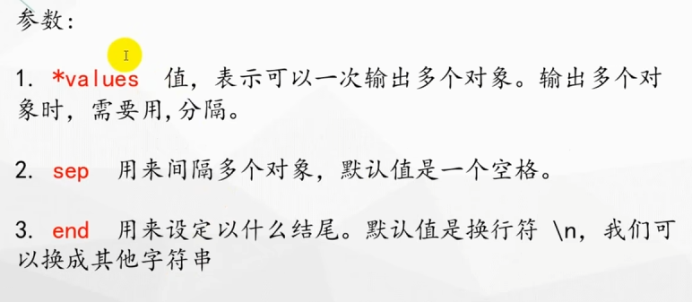

注意：print要顶格写，否则会报错

```
print(字符串，sep='用来间隔对象的符号')
print(字符串，end='后面拼接的值')#最后输出结果：第一个print中的字符串+后面拼接的值
+第二个print中的字符串
```

### <mark>变量</mark>

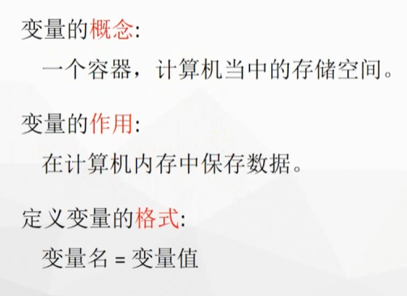

print（num1）

加上引号会打印引号里面的内容，没有引号就会被识别成变量名，打印的是变量的值，如果该变量没有被赋值，就会报命名错误

变量只有在赋值以后才会被创建，所以使用变量之前必须要赋值

#### <mark>变量的命名规范</mark>

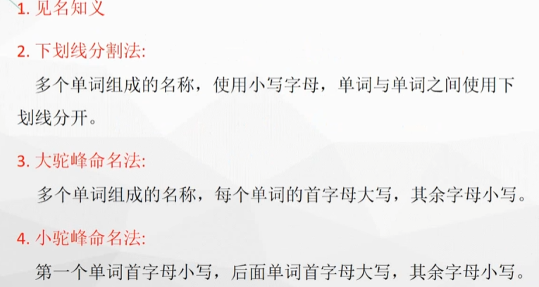

| 类型  | 规则         | 示例          |
| --- | ---------- | ----------- |
| 变量  | snake_case | user_name   |
| 函数  | snake_case | get_data    |
| 类   | PascalCase | UserInfo    |
| 常量  | UPPER_CASE | MAX_SIZE    |
| 文件  | snake_case | main_app.py |

变量函数用小写下划线，类用大驼峰，常量全大写

### <mark>标识符</mark>

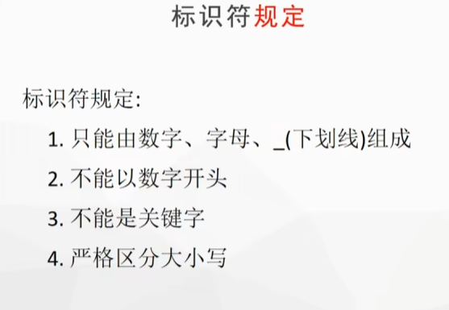

标识符被包含在（）内对标识符本身没有影响

### <mark>数值类型</mark>


bool类型有固定写法，一个为True，一个为False（必须严格区分大小写）

布尔值可以当作整形对待，True相当于整数1，False相当于整数0

complex复数型（了解）：

固定写法：z=a+bj      ----a是实部，b是虚部，j是虚数单位

### <mark>字符串</mark>

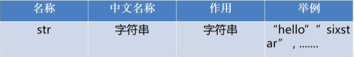字符串包含了多行内容的时候也可以使用三引号

### <mark>格式化输出</mark>

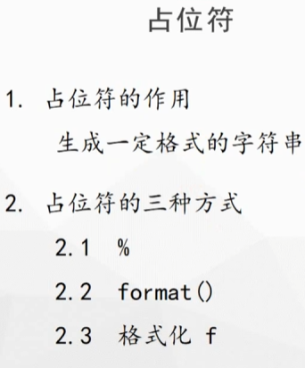

1.%s字符串（常用)

name ='bingbing'

print("我的名字：%s”% name)

注意：占位符只是占据位置，并不会被输出

2.%d 整数（常用)

age =18

name ='bingbing”

print("我的名字:%s，年龄：%d” %(name,age))

3.%4d整数

数字设置位数，不足前面补空白
a=123
print（%010d”%a）#表示输出的整数显示位数，不足的话用0补全，超出当前位数则原样输出

4.%f 浮点数(常用)

a=1.2345673

print("%f” % a)

默认后六位小数，遵循四舍五入原则

5. %. 4f 浮点数

数字设置小数位数，遵循四舍五入原则

b = 2.34567

print（"%.7f” % b）# 默认显示及7位小数

6. %%

print("我是%%的1%%”%（））

两个%%输出一个%

7.f格式化

格式:f"{表达式}“
name='bingbing’
age=18
print（f"我的名字是{nane}，我今年{age}岁了"）

### <mark>运算符</mark>

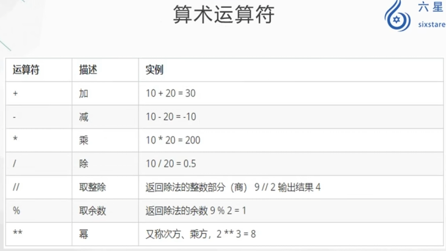

// 取整数，取商的整数部分，向下取整

使用算数运算符，其中若有浮点数，结果也会用浮点数表示

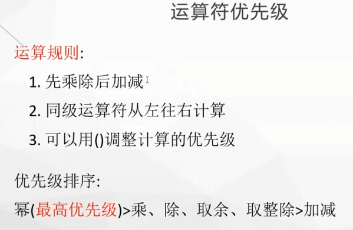

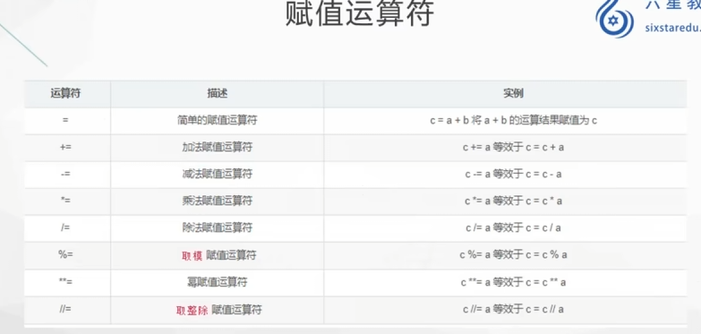

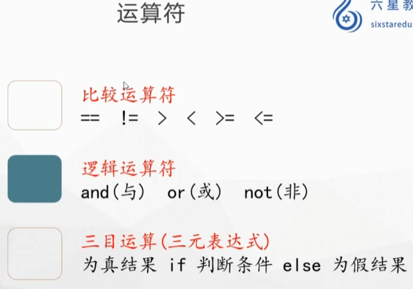

三目运算例子：

```
print(”a小于等于b”)  if  a<=b    else print(”a比b大”)
```

### <mark>输入函数input()</mark>

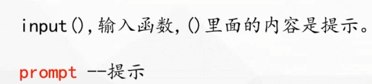

它的作用是：

> **从键盘获取用户输入的数据，并返回一个字符串类型。**

```
name = input("请输入你的名字：")   #括号里的内容只是提示文字，不会影响输入。
print(name)
#如果需要数字，需要转型，如age = int(input("请输入年龄："))
```

input().split()

```
a, b, c = input("请输入数字").split(",")
#按照，进行划分字符串并分别赋值给a，b，c（数量对不上会报错）
#如果想得到整数a, b, c = map(int, input().split())
print(a)
print(b)
print(c)  
#请输入数字10,20,30
10
20
30
```

```
l=input().split()
print(type(l))
#list
```

### <mark>转义字符</mark>

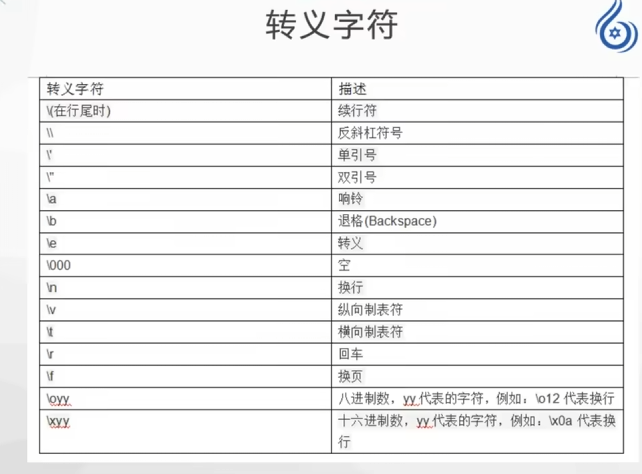

\r相当于删除前面的东西

 print（r’sixs\\\\\tar'）

输出结果为sixs\\\tar              #r原生字符串，默认取消转义

### <mark>if</mark>

#### **if判断语法**

```
 age =21
 if age <18:
     print（"未成年不能上网"）
```

#### **if else**

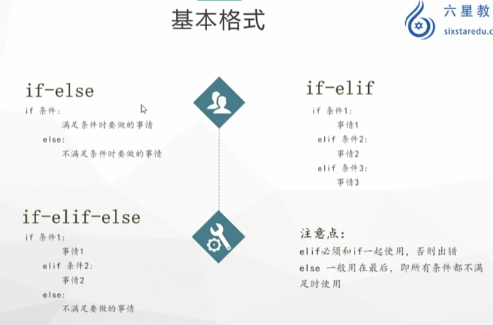

#### **if 嵌套**

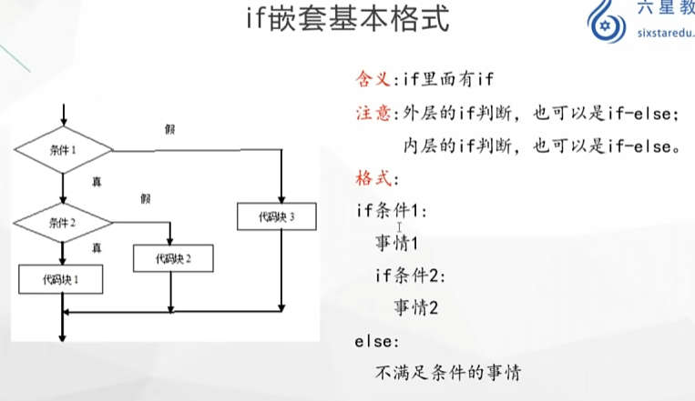

### <mark>循环</mark>

#### **while循环**

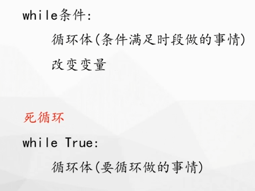

注意：python中没有自增或自减

只要条件不是False或0，其他单独存在的值也会是死循环

Python 用“缩进”来判断代码属于 while 内部还是外部

```
while i <= 3:
    ↑ 这一行开始循环
    print(...)   ← 在循环内部（有缩进）
    i += 1       ← 在循环内部（有缩进）

print(...)       ← 没有缩进 → 循环外
```

#### **while循环嵌套**

根据缩进来确定循环层级

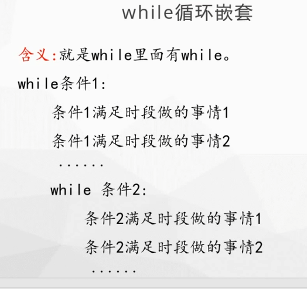

#### **for循环**

for循环基本格式：

```
for      临时变量     in    可迭代对象：
         循环体
```

range():用来记录循环次数，相当于一个计数器

range(start,stop,step)

range(1,6)：从1开始(包含1)，到6结束(不包含6)，遵循包前不包后规则 ，[)，如 [1,6)  1<=x<6

range()里面只写一个数，这个数就是循环的次数，默认从0开始

#### break和continue

break和continue只能放在循环内

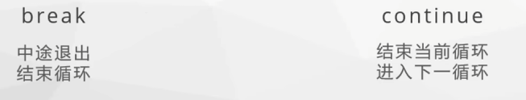

### <mark>字符串编码</mark>

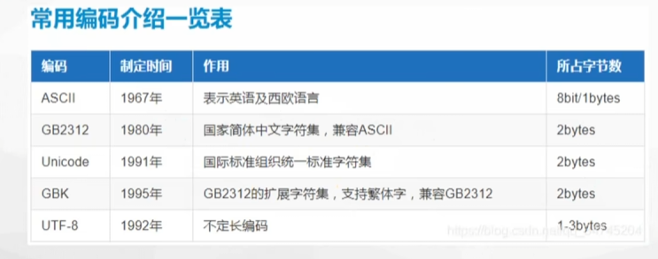

UTF-8：精准，对不同的字符用不同的长度表示
优点：节省空间
缺点：字符与数字的转换速度较慢，每次都需要计算字符要用多少个字节来表示

字符串编码转换

```
a=’hello'
print(a,type(a))   #str，字符串是以字符为单位进行处理
al= a.encode       # 编码
print(”编码后：“,al)
print(type(al)）   #bytes,以字节为单位进行处理的
a2= al.decode      #解码
print (a2,type (a2))
#注意：对于bytes,只需要知道它跟字符串类型之间的互相转换
```

#### **字符串运算符**

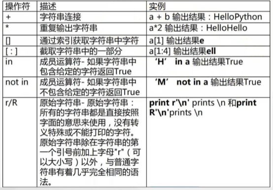

#### **字符串常见操作**

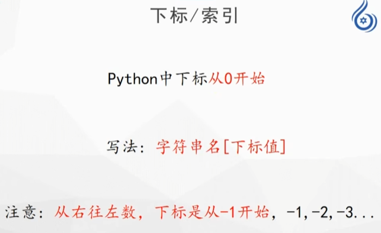

下标/索引举例：

```
字符串               a  b c d e f g
从左往右数下标        1  2 3 4 5 6 7
从右往左数下标        -7-6-5-4-3-2-1
```

切片的含义：只对操作的对象截取其中一部分的操作

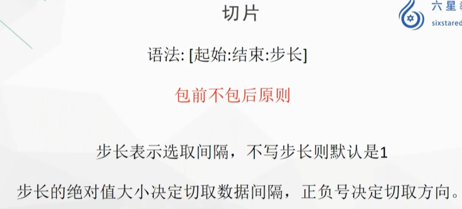

步长正数表示从左往右取值，负数表示从右往左取值

```
st ='abcdefghijk'
#从左往右
print (st[O:4])   # abcd
print(st[4:7])    # efg
print (st[3:])    #defghijik   ----下标为3之后的全部截取到
print(st[:7])     # abcdefg    ----下标为7之前的全部截取到，不包含7
#从右往左
print(st[-1:])    # k
print(st[:-1])    # abcdefghij
print(st[-1:-5])
```

步长间隔举例

```
st='abcdefg'
print(st[0::2])  #输出结果aceg
```

所以，步长为2，表示间隔2-1个字符再取值

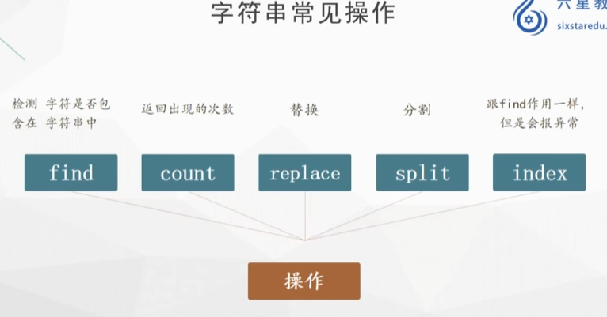

find()：检测某个子字符串是否包含在字符串中，如果在就返回这个子字符串开始位置的下标，否则就返回-1

格式：find（子字符串，开始位置下标，结束位置下标）

```
name='bingbing’
print (name.find('i'))    #1  ——第一个i的下标为1
print (name. find('bing')) #0—检测到第一个bing，b的下标为0
print (name.find('b’,3))  # 4
print (name.find('b’,5))  # -1  ——超出范围，不包含返回-1
print (name.find('b’3.5))_# 4  ——在下标3-5位置范围内查找
#包前不包后
print (name.find('b’,3,4）#-1
```

index():类似find，不同点：找不到子字符串就报错，且开始和结束位置下标可以省略，表示在整个字符串中查找

count():返回某个子字符串在整个字符串中出现的次数，没有就返回0

格式：count（子字符串，开始位置下标，结束位置下标）

```
name='bingbing'
print (name. count ('b')) # 2
print (name.count ('a'))  # 0
print (name.count (’b’,1)) #1
print (name.count('b',1,3)) #0
print(name.count(’b’,1,4)）#0  同样遵循包前不包后规则
```

replace()：替换

replace（旧内容，新内容，替换次数）

注意：替换次数可以省略，默认全部替换

```
name='好好学习，天天向上'
print(name.replace(”天”,’时’)）)   #好好学习，时时向上
print(name.replace("天”,’时’，1)） #好好学习，时天向上
```

split()：指定分隔符来切字符串

```
st='abcdefg'
print(st.split('d'))   #['abc', 'efg']
```

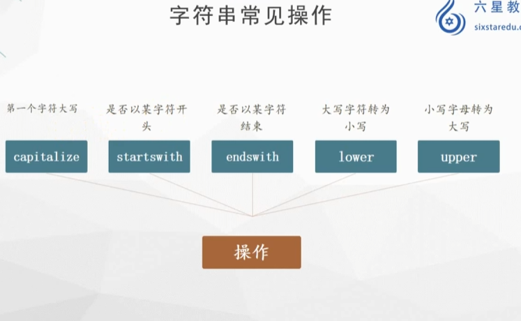

startswith()：是否以某个子字符串开头，是的话就返回True，不是的话就返回False，如果设置开始和结束位置下标，则在指定范围内检查

```
st='sixstar'
print(st.startswith('six'))   # True
print (st.startswith('sex'))  # False
print(st.startswith('s',2,6)） #FaLse
```

endswitch()：是否以某个子字符串结尾，是的话就返回True，不是的话就返回False，如果设置开始和结束位置下标，则在指定范围内检查

```
st ='sixstar'
print(st.endswith('er'))   # False
```

isupper()：检测字符串中所有的字母是否都为大写，是的话就返回True

```
st ='sixstar'
print(st.isupper())    # False
print('SIX'.isupper()) # True
```

### <mark>列表</mark>

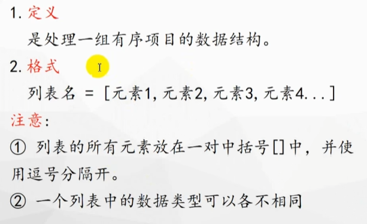

列表的类型：list

列表也可以进行切片操作;列表是可迭代对象，可以for循环遍历取值

#### **列表相关操作**

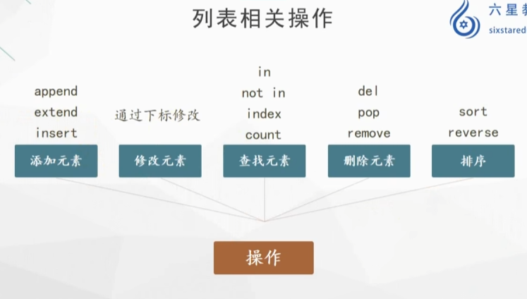

添加元素

append：整体添加

extend：分散添加，将另外一个类型中的元素逐一添加

insert：在指定位置插入元素，指定位置如果有元素，原有元素就会后移

```
li=['one','two','three']
li.append("four")   #append整体添加
li.extend('four')   #extend分散添加,将另外一个类型中的元素逐一添加
li.insert (3,’four') # 在指定位置插入元素
li.insert (O,'four') #指定位置如果有元素，原有元素就会后移
li.insert("four")    #报错，没有指定下标
```

查找元素

in:判断指定元素是否存在列表中，如果存在就返回True，不存在就返回False
not in:判断指定元素是否存在列表中，如果不存在就返回True,存在就返回False

```
li=['a','b','c','d']
print('e’ in  li)
```

删除元素

```
#del
li=['a','b','c','d']
del li  # 删除列表
del li[2] #根据下标删除
```

```
#pop:可以删除指定下标的数据，如果没有指定下标，则默认删除最后一个元素
li =[’a’,'b’,’c’,' d’]
1i.pop()   #默认删除最后一个元素
1i.pop（4）#不能指定元素删除，只能根据下标进行删除，下标不能超出范围
```

```
#remove：根据元素的值进行删除,若列表中不存在这个元素则会报错
li=['a','b','c','d'，'b']
li.remove('d')
li.remove('b')    #默认删除最开始出现的指定元素
```

排序

sort:将列表按特定顺序重新排列，默认从小到大

reverse：倒序，将列表倒置（反过来)

```
li=[1,5,3,2,4]
li.sort()     #li=[1,2,3,4,5]按照从小到大的顺序排序
li.reverse()  #li=[4,2,3,5,1]倒序
```

### <mark>列表推导式</mark>

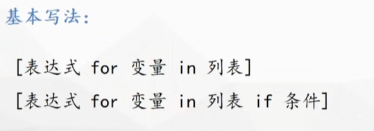

<u>注意：</u>列表推导式里的“表达式”本质上必须是“一行表达式”

#### **列表嵌套**

含义：一个列表里面又有一个列表

```
1i=[1,2,3,[4,5.6]]   #[4，5，6]是里面的列表
print(1i[3]）        #取出里面的列表
print(li[3][2]）     #取出内列表中的下标为2的元素
```

### <mark>元组</mark>

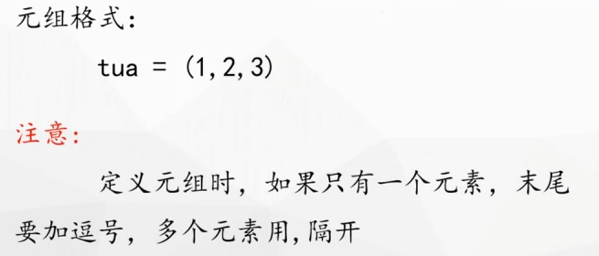

元组的数据类型为tuple

tua=()   #定义空元组

元组与列表的区别：

1. 元组只有一个元素末尾必须加，列表不需要

2. 元组只支持查询操作，不支持增删改操作(数据不可以被修改，保护数据的安全)

格式化输出后面的()本质上就是一个元组

```
name='bingbing'
age =18
print ("%s的年龄是:%d" %(name,age))
info=(name,age)
print (type(info))
print（"%s的年龄是:%d” % info)
```

### <mark>字典</mark>

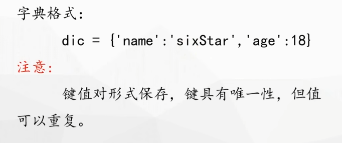

基本格式：字典名={键1：值1，键2，值2...}

```
dic2= ('name’:'bingbing','name':'susu'} #不会报错，键名重复前面的值会被后面的
值覆盖
```

### <mark>字典常见操作</mark>

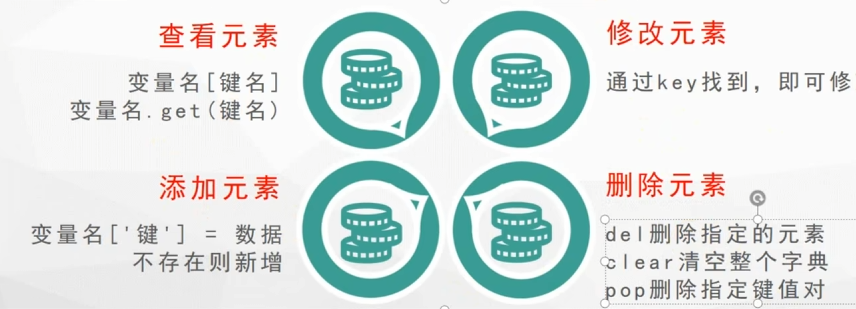

注意：字典中没有下标，查找元素需要根据键名，键名相当于下标

#### **查看元素**

```
dic ={'name':'bingbing','age’:18}
print(dic['age'])  #18
print(dic.get（"tel")）      #None  一一键名不存在，返回None
print(dic.get（"te1",'不存在')）#不存在 ——如果没有这个键名，返回自己设置的默认值
```

#### **修改元素**

```
dic ={'name':'bingbing','age’:18}
dic['age']=20       #列表通过下标修改，字典通过键名修改
```

#### **添加元素**

```
dic ={'name':'bingbing','age’:18}
dic[’tel']= 1244668  #此时没有tel键，新增进字典
```

| 方法                | 作用          | 示例                     |
| ----------------- | ----------- | ---------------------- |
| `dict[key]=value` | 添加/修改单个元素 ⭐ | `d["name"]="Tom"`      |
| `update()`        | 批量添加        | `d.update({"age":18})` |
| `setdefault()`    | 不存在才添加      | `d.setdefault("a",1)`  |
| `append()`        | 不能直接用于字典    | 只用于列表                  |

字典.setdefault(键, 默认值)

特点：

- 键不存在 → 添加
- 键存在 → 不修改

```
student = {}
student.setdefault("name", "Tom")
print(student)   #{'name': 'Tom'}
```

#### **删除元素**

del：删除字典或删除指定键值对

```
dic = {'name':'bingbing','age':18}
del dic   #删除整个字典 del字典名
```

```
dic = {'name':'bingbing','age':18}
del dicl'age']   #删除指定键值对
del dic['tel']    #没有指定的键就会报错
```

clear()：清空整个字典里面的东西，但保留了这个字典

```
dic = {'name':'bingbing','age':18}
dic.clear()
```

pop()：删除指定键值对，键不存在就会报错

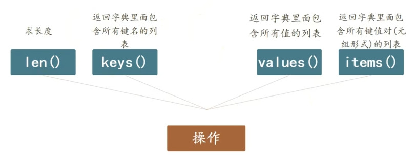

#### **len()求长度**

```
dic = {'name':'bingbing','age':18,'tel':'123'}
print(len(dic))  #3，字典中有3个键值对
```

#### **keys():返回字典里包含的所有键名**

```
dic = {'name':'bingbing','age':18}
print(dic.keys())   #dict_keys(['name','age']) 只取出键名
```

#### **values() :返回字典里面包含的所有值**

```
dic = {'name':'bingbing','age':18}
print(dic.values())
```

#### **items() :返回字典里面包含的所有键值对，且以元组形式返回**

```
dic = {'name':'bingbing','age':18}
print(dic.items())   
#dict_items([('name', 'bingbing'), ('age', 18)])
```

### <mark>集合</mark>

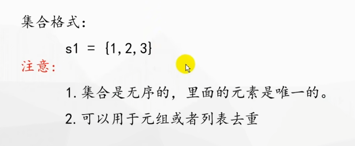

无序性：不能修改集合中的值

集合具有唯一性，可以自动去重

集合的类型为set

```
s1 = ()     # 定义空字典
sl = set()  # 定义空集合  
```

### <mark>集合常见操作</mark>

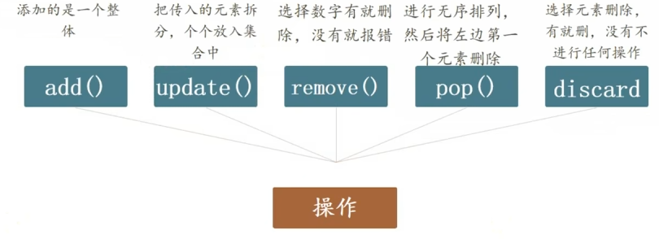

#### **添加元素**

add添加的是一个整体

集合的唯一性，决定了如果需要添加的元素在原集合中已经存在，就不进行任何操作

```
s2={1,2,3,4} 
s2.add(1)  #元素已存在，会报错
s2.add(5)  #S2={1,2,3,4,5}
s2.add(5,6)  #一次只能添加一个元素，s2.add((5,6)),将5，6打包成元组就行
```

update()把传入的元素拆分，一个个放进集合中

update()中的元素必须是能够被我们for循环取值的可迭代对象

#### **删除元素**

remove：选择删除的元素，如果集合中有就删除，没有就会报错

```
s2 = (1, 2, 3, 4)
s2. remove (3)
s2.remove (5)   #报错，集合中没有5这个元素
```

pop：随机删除一个元素

discard:选择要删除的元素，有就会删除。没有则不会发生任何改变，即不会进行任何操作

### <mark>交集和并集</mark>

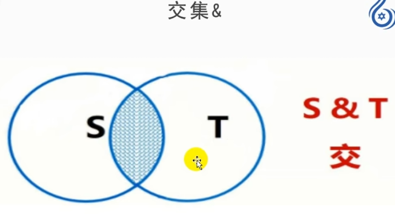

```
a={1,2,3,4}
b={5,6,7,8}  
print(a&b)   #没有共有的部分返回空集合set()
```

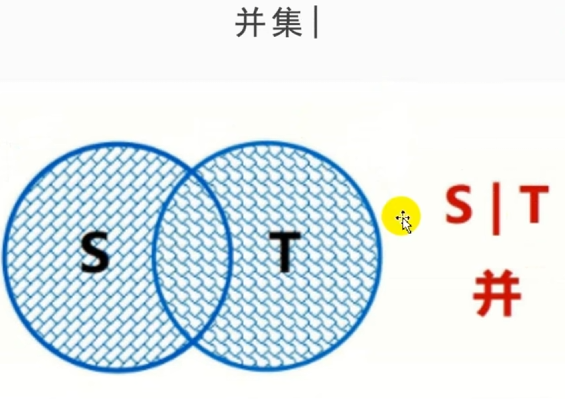

并集：所有的都放一起，重复的不算（集合的唯一性）

```
a={1,2,3.4}
b={3,4,5.6}
print(a | b)  #{1,2,3.4，5，6}
```

### <mark>类型转换</mark>

 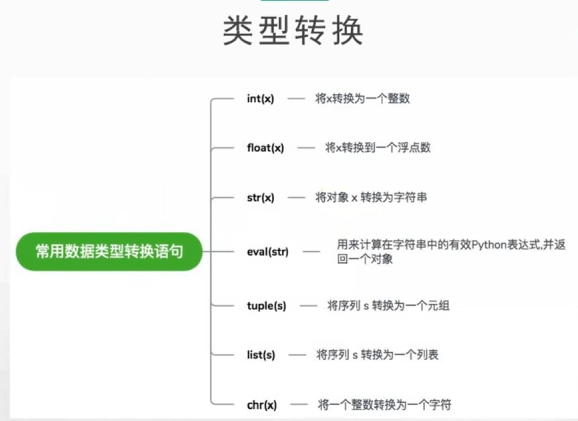

| 转换方向       | 使用方法      | 示例                | 结果            |
| ---------- | --------- | ----------------- | ------------- |
| 其他类型 → 列表  | `list()`  | `list((1,2,3))`   | `[1,2,3]`     |
| 其他类型 → 元组  | `tuple()` | `tuple([1,2,3])`  | `(1,2,3)`     |
| 其他类型 → 集合  | `set()`   | `set([1,2,2])`    | `{1,2}`       |
| 其他类型 → 字符串 | `str()`   | `str([1,2,3])`    | `"[1, 2, 3]"` |
| 字典转换       | `dict()`  | `dict([("a",1)])` | `{'a':1}`     |

<u>注意：</u>字典转换默认只取键

浮点型强转整型会去掉小数点及后面的数值，只保留整数部分

input默认输入的是字符串类型

整型转换为浮点型，会自动添加一位小数

```
print（eval（'10+10'））   #20，执行运算，并返回运算值
```

eval()可以实现list、dict、tuple和str之间的转换

eval表面现象：eval 看起来像是“去掉外层引号”
本质：eval 会把字符串当作 Python 代码执行，从而还原成对应的对象（前提是字符串是合法表达式）

<u>注意：</u>eval()非常强大，但是不够安全，容易被恶意修改数据，不建议使用

list():将可迭代对象转换成列表

支持转换为list的类型：str、tuple、dict、set

```
#字典转换成列表，会取键名作为列表的值
print(list({'name':'bingbing','age':18})  #['name','age']
```

集合转换成列表，会先去重，再转换

### <mark>深浅拷贝</mark>

<u>注意：</u>深浅拷贝只针对可变对象，不可变对象没有拷贝的说法

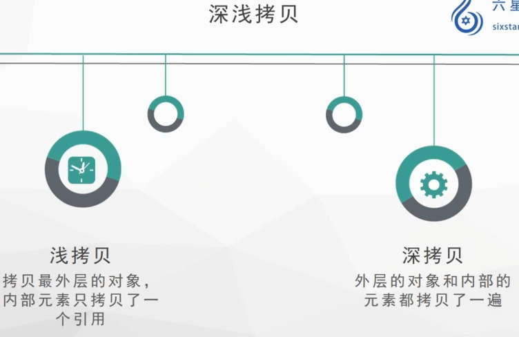

#### **赋值（只是一个对象多个名称）：**

```
li=[1,2,3,4]
li2=li
li.append(5)
print(li)   #[1,2,3,4,5]
print(li2)  #[1,2,3,4,5]
#赋值.等于完全共享资源，一个值的改变会完全被另一个值共享,此时li和li2内存地址相同，
指向的是同一个地址
```

#### **浅拷贝（外层独立，内层共享）：**

```
import copy
li=[1,2,3,4,[5,6]]
li2=copy.copy(li)
li2.append(7)
print(li)  #[1,2,3,4,[5,6]]
print(li2) #[1,2,3,4,[5,6],7]
#此时li和li2外层内存地址不同，但内层嵌套地址相同
import copy
li=[1,2,3,4,[5,6],8]
li2=copy.copy(li)
li2[4].append(7)
print(li)   #[1, 2, 3, 4, [5, 6, 7], 8]
print(li2)  #[1, 2, 3, 4, [5, 6, 7], 8]
```

<u>注意：</u>在多层嵌套中，浅拷贝只有最外层不一样

#### **深拷贝（创建一个新对象，并将原来对象的内容完全复制过来）：**

```
import copy
li=[1,2,3,[4,5,6]]
li2=copy.deepcopy(li)  #深拷贝
#深拷贝数据变化只影响自己本身，跟原来的对象没有关联
```

### <mark>可变对象</mark>

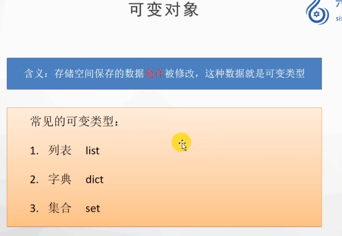

可变类型含义：变量对应的值可以修改，但是内存地址不会发生改变

在 Python 里，用来“求地址”的函数是： id()

```
a = 10
print(id(a))
```

### <mark>不可变对象</mark>

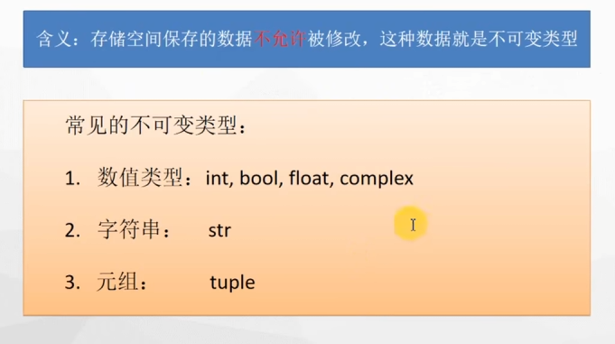

不可变类型指的是一旦创建，这个对象的值就**不能被修改**，任何“修改操作”都会生成一个新对象。

### <mark>函数</mark>

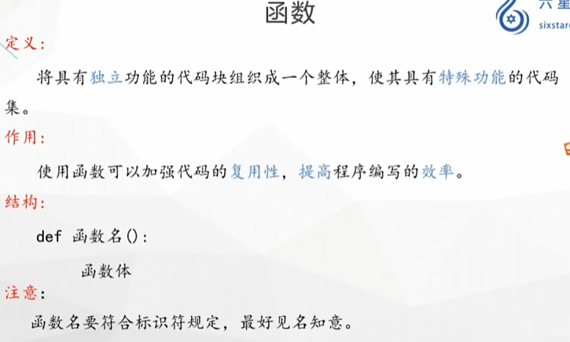

调用函数前，必须保证函数已经存在

#### **返回值**

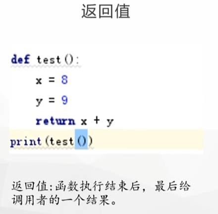

函数里面有return的话，需要打印才能看见返回值，且函数中return下面的代码不会被执行

返回值的三种情况总结：

1. 一个返回值也没有，返回的结果是None

2. 一个返回值，就把值返回给调用者

3. 多个返回值，以元组的形式返回给调用者

return和print区别：

1. return表示此函数结束，print会一直执行

2. return是返回计算值，print是打印结果

#### **参数**

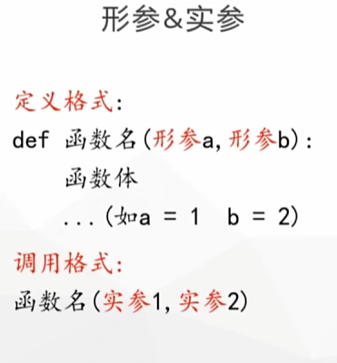

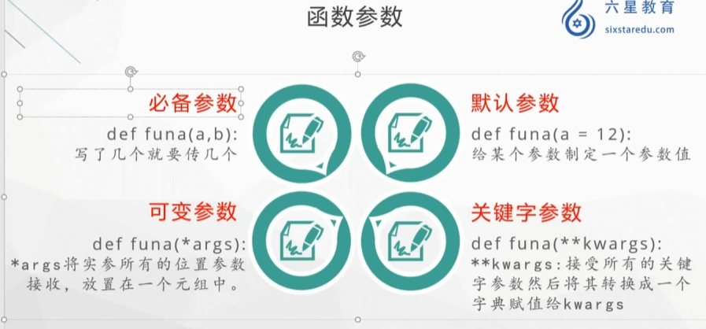

##### 必备参数（位置参数）

含义：传递和定义参数的顺序及个数必须一致

##### 默认参数

含义：为参数提供默认值，调用函数时可不传该默认参数的值
注意：所有的位置参数必须出现在默认参数前，包括函数定义和调用

设置默认值，没有传值会根据默认值来执行代码，传了值根据传入的值来执行代码

##### 可变参数

含义：传入的值的数量是可以改变的，可以传入多个，也可以不传

它传值的方式是：

> **调用函数时，把多个位置参数打包成一个元组（tuple），传递给 `args`。**

```
def test(*args):
    for i in args:
        print(i)
test(10, "hello", [1, 2, 3])
#10
hello
[1, 2, 3]
```

**注意：**

字典可以传给 `*args`，但会作为一个普通对象处理；想传递字典里的键值对，要使用 `**kwargs`。（`*字典` 默认拆的是**字典的键**。）

```
def test(*args):
    print(args)
d = {"name": "Tom", "age": 18}
test(*d)
#('name', 'age')
```

##### 关键字参数

```
def fund(**kwargs):
    print(kwargs)
fund(name='bingbing',age=18) #需要以键值对的形式传入参数
```

#### **函数嵌套**

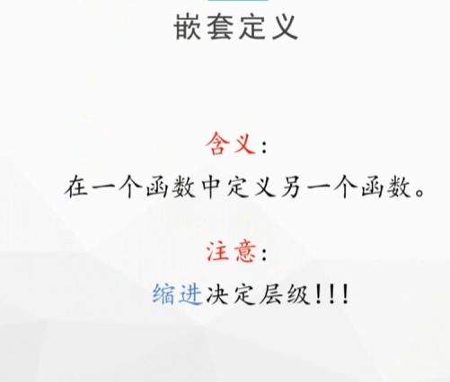

```
def study():     #外函数
    print("晚上在学习")
    def course():  #内函数
        print("python基础")  #不要在内层函数中调用外层函数会陷入死循环，直到超过
递归的最大深度
    course()   #注意：注意缩进，定义和调用是同级的，调用如果在定义里面则永远调用不到
study()
```

### **<mark>函数进阶</mark>**

#### 作用域

含义：指的是变量生效的范围，分为两种，分别是全局变量和局部变量

函数内部如果要使用变量，有的话就直接使用：没有会到函数外面去找。

局部变量作用：在函数体内部，临时保存数据，即当函数调用完成之后，就销毁局部变量

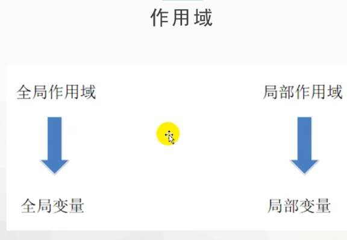

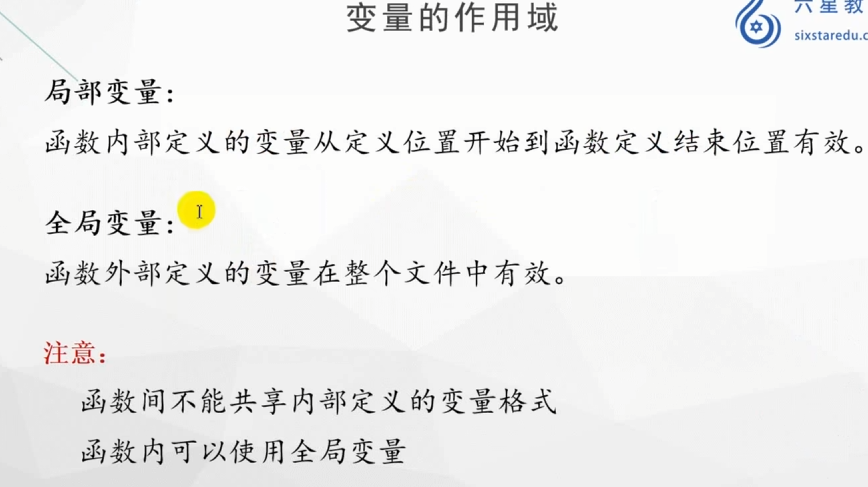

在函数内部修改全局变量的值，可以使用global关键字

global：将变量声明为全局变量

```
def study():
    global name
    name="python"
    print(name)
study()
print(name)
```

nonlocal（了解）：用来声明外层的局部变量，只能在嵌套函数中使用，在外部函数先进行声明，内部函数进行nonlocal声明

总结：nonlocal只能对上一级进行修改

#### **匿名函数**

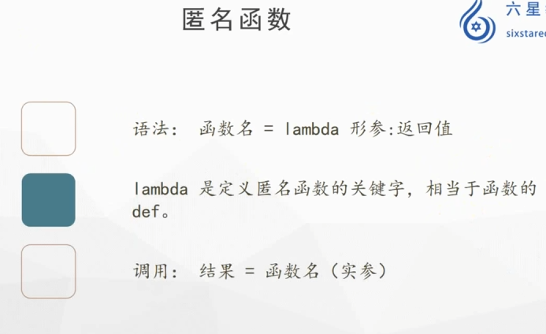

匿名函数只能写一个表达式

```
#普通函数
def add(a,b)
    return a+b
print(add(1,3))
#匿名函数
add=lambda a,b:a+b  #a,b就是匿名函数的形参，a+b是返回值的表达式
#lambda不需要写return来返回值，表达式本身结果就是返回值
print(add(1,5))
```

 lambda结合if判度

comp=lambda a,b："a比b小"   if a<b else  "a大于等于b"      #a/b是形参，比较大小

#### **内置函数**

```
#查看所有的内置函数
import builtins
print(dir(builtins))
```

大写字母开头一般是内置常量名，小写字母开头一般是内置函数名

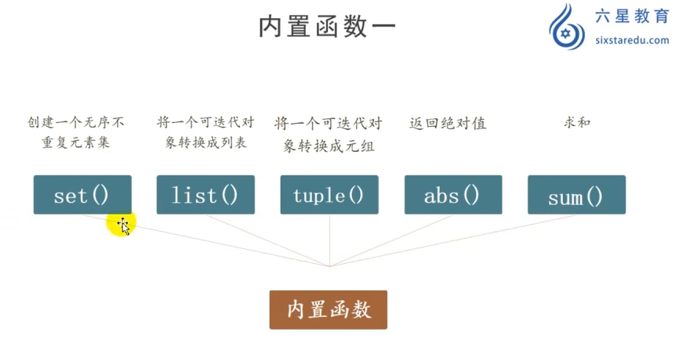

sum函数内要放可迭代对象

```
print(sum({1.5,3,4}))   #8.5
```

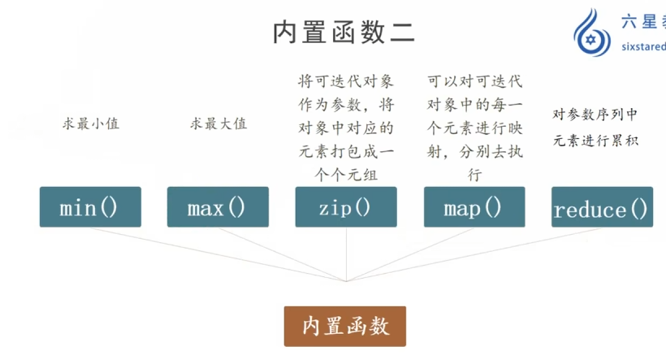

```
print(min(-8,5,key=abs))  #5  传入了求绝对值，则参数就会先求绝对值再取较小值
```

zip（）：将可迭代对象作为参数，将对象中<u>对应的</u>元素打包成一个个元组

```
li=[1,2,3]
li2=['a','b','c']
print(zip(li,li2))
第一种方式：通过for循环
for i in zip（li,li2）:
    print(i)   #[(1,'a'),(2,'b'),(3,'c')]
#如果元素个数不一致，就按照长度最短的返回
#第二种方式：转换成列表打印
print(list(zip(li,li2)))   #转换成列表打印
#注意：必须是可迭代对象 
```

map()：可以对可迭代对象中的每个元素进行映射，分别去执行

```
map(func,iter1):func--自己定义的函数  iter1--要放进去的可迭代对象
#简单来说就是对象中的每一个元素都会去执行这个函数
li=[1,2,3]
def funa(x):
    return x*5
mp=map(funa,li)

# 第一种方式：for循环取出
# for i in mp:
#
print(i)
#第二种：转换成列表打印
print (list (mp))
```

 迭代器（Iterator）

- map
- filter
- zip
- reversed
- file object
- generator
- generator expression

直接打印迭代器，打印的是对象本身（即map对象的内存地址），不是里面的值

如果想要查看迭代器里面的内容，有以下方法

1. 转 list（最常用）

2. for循环遍历

3. next逐个取

**<u>注意：迭代器只能用一次</u>**

reduce():先把对象中的两个元素取出，计算出一个值然后保存着，接下来把这个计算值跟第三个元素进行计算

```
#需要先导包
from fuunctools import reduce
reduce (function,sequence)  #function-—函数：必须是有两个参数的函数，sequence
-—序列：可迭代对象
li2=[1,2,3,4]
def add(x,y):
    return x+y
res=reduce(add,li2)
print(res) #10
```

#### **拆包**

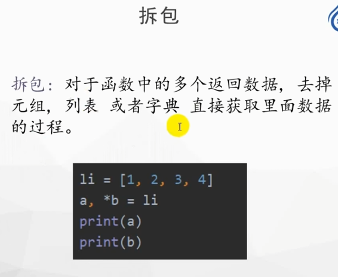

拆包方法：

```
tua=(1,2,3,4)
#方法一：
a, b, c, d = tua
print("a=", a,"b=",b,"c=", c,"d=",d)
#要求元组内的个数与接收的变量个数相同，对象内有多少个数据就需要定义多少个变量接收
#一般在获取元组值的时候使用
#方法二：
```

### <mark>异常</mark>

异常：是一个事件，这个事件在程序执行过程中发生，影响了程序的正常执行。

当Python检测到一个错误时，解释器就无法继续执行了，反而出现了一些错误的提示，这就是所谓的”异常”

异常种类：

- AttributeError    试图访问一个对象没有的属性

- IOError    输入/输出异常；基本上是无法打开文件

- ImportError      无法引入模块或包；基本上是路径问题或名称错误

- IndentationError    语法错误（的子类）；代码没有正确对齐

- IndexError    下标索引超出序列边界

- KeyError      试图访问字典里不存在的键

- KeyboardInterrupt     用户中断执行(通常是Ctrl+C被按下)

- NameError    使用一个还未被赋予对象的变量

- SyntaxError   Python代码非法，代码不能编译

- TypeError     传入对象类型与要求的不符合

- ValueError    传入一个调用者不期望的值

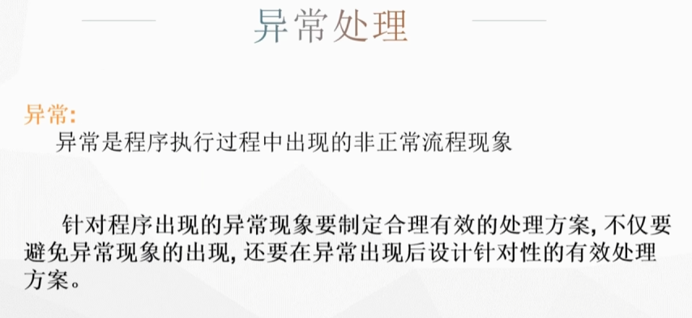

异常处理最终目的：让程序在有异常时，仍能够正常运行

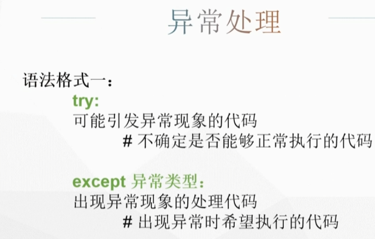

```
#法一
try:
    print(a)
except： #基类异常
    print('出现错误')
b=10
print(b)

#法二
try:
    print(a)
except NameError as e: #指定捕获异常类型为NameError，取别名为e
    print(e)
b=10
print(b)

#法三
try:
    print(a)
except Exception as e:  #万能异常Exception可以捕获任意异常
    print(e)
b=10
print(b)

#法四
try:
    print(a)
except IndexError as e:
    print(e)
except KeyError as e:
    print(e)
except NameError as e:
    print(e)
```

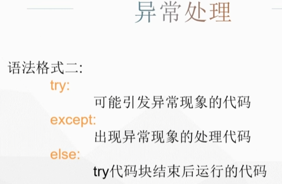

else只有在没有异常时才会执行的代码。可把except理解为if，except和else不同时执行

```
dic={'name':'zs'}
try
    print(dic['age'])
except Exception:
    print('出现错误')
else:
    print('没有捕获到异常')
```

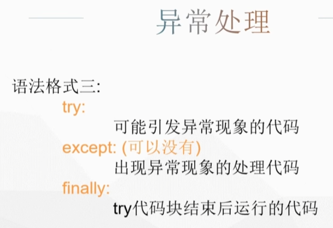

try-------finally,finally  无论是否有异常，都会执行的代码

```
dic={'name':'zs'}
try
    print(dic['age'])
except Exception:
    print('出现错误')
finally:
    print('哈哈哈')
#出现错误
 哈哈哈
```

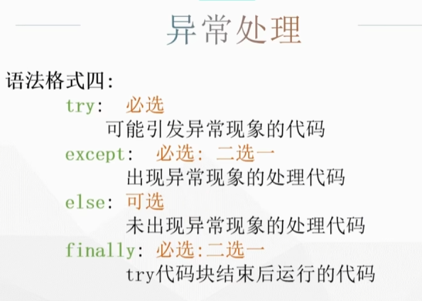

```
try:
    n=int(input（’请输入一个整数：'))
    print (10/n)
except ValueError:
    print（'请输入正确的数据')
except Exception as e:
    print（'未知错误%s'%e)
else:
    print（没有异常时才会执行的代码’）
finally:
    print（'无论有无异常,都会执行的代码'）
```

#### **抛出异常 raise**

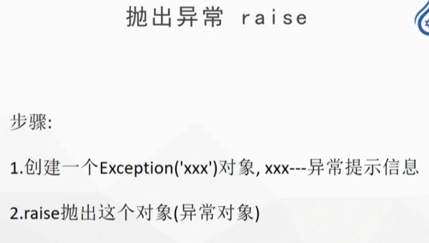

```
def funa ():
        raise   Exception("冰冰抛出了一个异常”)
        print（”哈哈哈，笑死我了”)      #执行了raise语法，代码不会继续往下运行
funa()
```

```
def login():
    pwd=input（”请输入您的密码：")
    if len(pwd) >= 6:
        return”密码输入成功”
    raise Exception（”长度不足六位，密码输入失败”)
print(login())
```

### <mark>模块</mark>

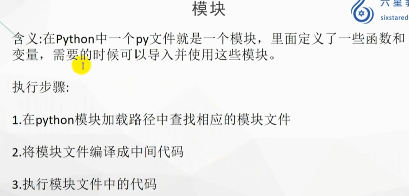

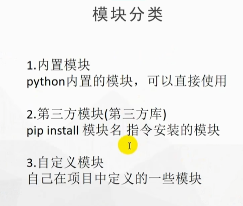

#### **内置模块**

如:random,time,os,logging,直接导入即可使用

#### **第三方模块（第三方库）**

下载：cmd窗口输入pip install 模块名

#### **自定义模块**

即自己在项目中定义的模块

<u>**注意：**</u>命名要遵循标识符规定以及变量的命名规范，并且不要与内置模块起冲突，否则将导致模块功能无法使用

#### **导入模块**

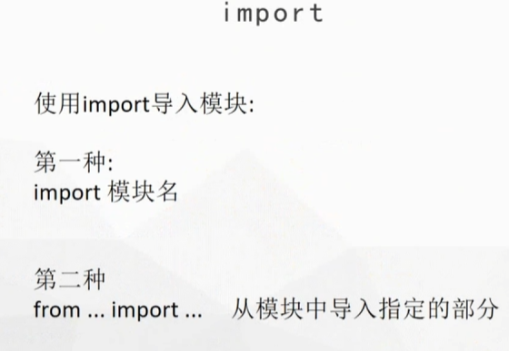

第二种：form 模块名 import 功能1，功能2....

第三种：from 模块名 import *   # 把模块中的所有内容全部导入

不建议使用第三种，有时候命名冲突会造成一些错误

#### **as给模块起别名**

语法：import 模块名 as 

```
import pytest as pt
#调用模块中的funa()
P.funa()
#打印模块中name变量
print (pt.name) 
```

#### **as给功能起别名**

语法：from 模块名 import 功能 as 别名

```
from pytest import funa as a,name,funb as b #这里的name是变量
a()
print (name)
b()
# 注意：导入多个功能，使用，将功能与功能隔开，后面的功能也可以取别名：功能名 as 别名
```

#### **内置全局变量\_\_name\_\_**

语法：if\_\_name\_\_=="main"

作用：用来控制py文件在不同的应用场景执行不同的逻辑

#### \_\_name\_\_

1. 文件在当前程序执行（即自己执行自己）：\_\_name\_\_=="\_\_main\_\_"

2. 文件被当作模块被其他文件导入：\_\_name\_\_==模块名

```
if __name__=="name":    #被当作模块导入时，下面的代码不会被显示出来
    print（"这是pytest2作为模块不会显示的内容"） 
```

### **<mark>包</mark>**

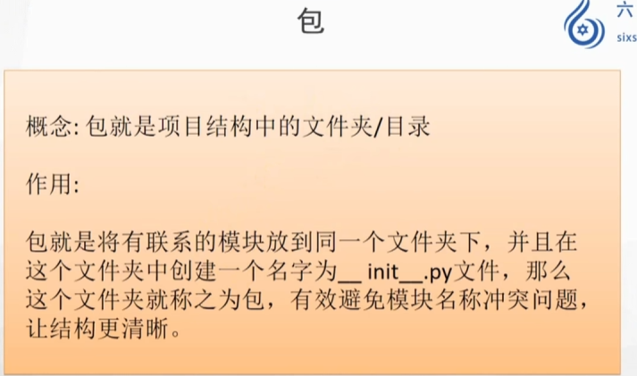

新建包：右键项目名-> new->python package

import导入\_\_init\_\_.py包时，首先执行\_\_init\_\_.py文件中的代码,所以不建议在init文件中写大量代码

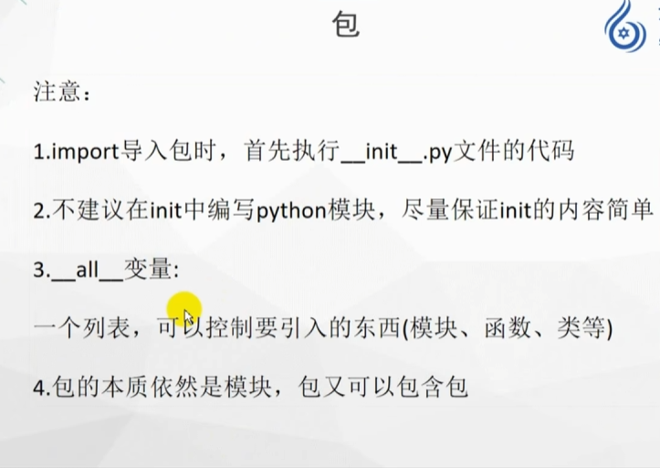

```
__all__：本质上是一个列表，列表里面的元素就代表要导入的模块
格式：all=['模块名']  #这表示all在哪个文件中，那么其他文件导包时，只能导入all中的内容
```

### <mark>递归函数</mark>

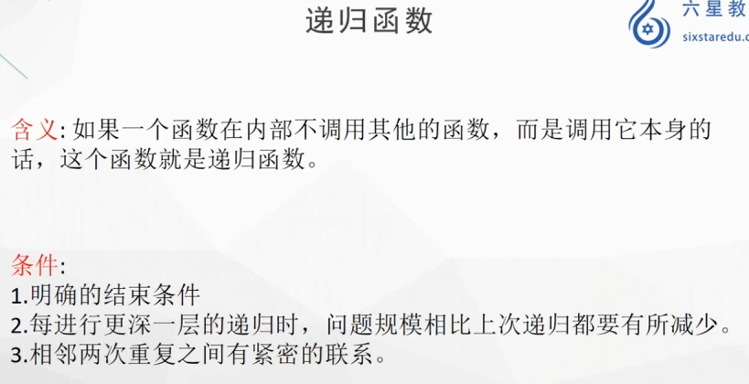

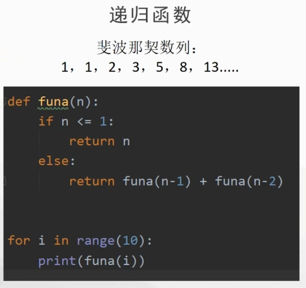

递归函数优点：简洁、逻辑清晰、解题更具有思路

缺点：使用递归函数的时候，需要反复调用函数，耗内存，运行效率低

### <mark>**闭包**</mark>

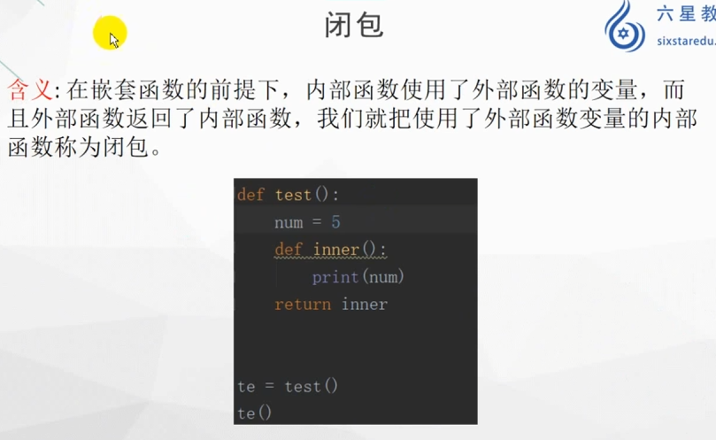

```
def outer():    # 外层函数
    n=10       #外层函数的局部变量
    def inner():  #内层函数
        print (n)     #内层函数使用外层函数的局部变量
#外层函数的返回值是内层函数的函数名
    return inner    #不加括号返回闭包可复用，加括号仅得单次结果 
print (outer())   #返回的是内部函数的内存地址
#第一种调用写法
outer()()
# 第二种调用写法
ot =outer()   #调用外函数
ot()          #调用内函数
```

每次开启内函数都在使用同一份闭包变量

Python 中的**闭包（closure）**，本质上是：

> **一个函数“记住了外层函数的变量”，即使外层函数已经执行结束。**

```
def outer(m):
    print("outer()函数中的值:",m)
    def inner(n):
        print("inner()函数中的值:",n)
        return m+n  #在inner函数中返回m+n的值
    return inner
ot=outer(10) #调用外函数，给outer()传值
#print(ot)  
#第一次调用内函数，给inner()函数传值
print (ot(20))  #调用内函数，给inner传值  10+20
#第二次调用内函数
print (ot(40))   #10+40
#第三次调用内函数
print (ot(80))  #10+80

#总结：使用闭包的过程中，一旦外函数被调用一次，返回了内函数的引用。虽然每次调用内函数，
会开启一个函数，执行后消亡
#但是闭包变量实际上只有一份，每次开启后内函数都在使用同一份闭包变量（闭包变量即外函数的
局部变量）
```

### <mark>**装饰器**</mark>

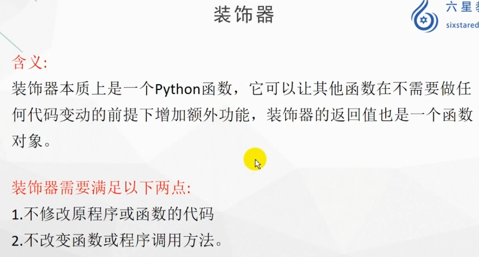

装饰器本质上就是一个闭包函数

装饰器的原理就是将原有的函数名重新定义为以原函数为参数的闭包 

装饰器的基础思想：函数作为参数传递

```
def test02():
    print("发送消息")
def test(fn):  #此时fn作为形参来接收test02
    print("开始注册")
    print("登录")
    fn()
test(test02) 
#开始注册
登录
发送消息
```

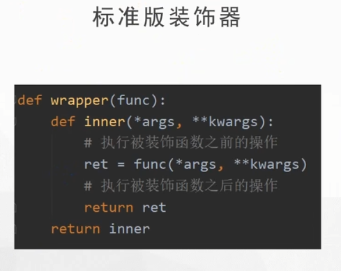

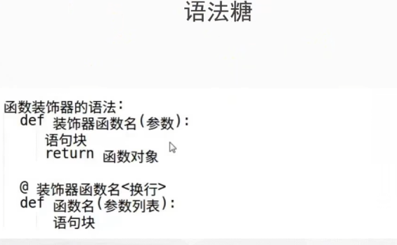

语法糖就是“为了让程序员写得舒服而设计的简化语法”，本质上仍然会被转换成更基础的代码执行。

```
def outer(fn):
    def inner():
        print("登录...")
        #执行被装饰的函数
        fn()
    return inner
#注意：装饰器名称后面不要加上()，前者是引用，后者是调用函数，返回该函数要返回的值
@outer
def send():
    print（"发送消息：笑死我了”）
send()
#登录...
发送消息：笑死我了
```

 不使用语法糖的写法：

```
def outer(fn):
    def inner():
        print("登录...")
        # 执行被装饰的函数
        fn()  #此时的fn还是原来的send函数
    return inner
def send():
    print("发送消息：笑死我了")

send = outer(send)   # 这个步骤之后send函数变为了inner函数
send()
#这里用到了两个 Python 特性：
① 函数可以作为变量传递
② 闭包保存外部变量
```

 一般情况下：

> **调用外层函数时，不会自动调用内层函数。**

只有当外层函数**主动调用内层函数**，或者**返回内层函数后再调用返回值**时，内层函数才会执行。

#### 装饰函数和被装饰函数

在 Python 装饰器中：

- **被装饰函数（decorated function）**：被“加工”的那个原函数
  
  它是：
  
  > 原本要执行的业务功能函数
  
  也就是“被添加功能”的对象。

- **装饰函数（decorator function）**：负责“加工”别人的函数的函数
  
  它是：
  
  > 接收一个函数，并返回一个新函数的函数
  
  它负责给 `send` 增加功能。

```
def outer(fn):        # 装饰函数
    def inner():      # 包装函数
        print("登录...")
        fn()
    return inner


def send():           # 被装饰函数
    print("发送消息")


send = outer(send)    # 装饰
send()
```

在 CPython（最常见的 Python 实现）中，`id()` 的返回值通常就是对象在内存中的地址；但从 Python 语言规范来看，`id` 只是对象的唯一身份标识，不保证一定等同于内存地址。

#### **多个装饰器**

多个装饰器的装饰过程，离函数最近的装饰器先装饰，然后外面的装饰器再进行装饰，由内到外的装饰过程（修饰器是从上而下运行从下而上修饰）

```
#第一个装饰器
def decol(fn):
    def inner():
        return "哈哈哈"+fn()+"呵呵呵"
    return inner
#第二个装饰器
def deco2(fn):
    def inner():
        return "奈斯"+fn()+"非常优秀"
    return inner

@deco1
@deco2  #2先装饰，随后1装饰
def test1():
    return "晚上在学习python基础"
print(test1())
#哈哈哈奈斯晚上在学习python基础非常优秀呵呵呵
```

### **<mark>引用和对象</mark>**

| 名称  | 含义         |
| --- | ---------- |
| 对象  | 实际的数据      |
| 变量  | 对象的名字      |
| 引用  | 变量和对象之间的连接 |

#### 一句话总结：

> **引用就是“变量指向对象的关系”。Python 变量保存的是对象的引用，而不是对象本身。**

```
class Person: 
    pass 
p = Person()
```

| 名称         | 本质             |
| ---------- | -------------- |
| `Person`   | 类对象的引用（指向类）    |
| `Person()` | 创建实例对象的过程      |
| `p`        | 实例对象的引用（变量名）   |
| 真正的对象      | 内存中的 Person 实例 |

`Person()` 创建的<u>实例对象</u>本身存在于内存中，通常没有直接名字（相当于隐藏了）；通过 `p = Person()` 把对象的引用保存下来，我们就可以通过 p 访问这个实例对象。

Python 中：

> **变量、类属性、实例属性都可以保存任何对象。**
> 
> 因为类属性和实例属性，本质是变量，可以保存任何对象

## <mark>python进阶</mark>

### <mark>**面向对象**</mark>

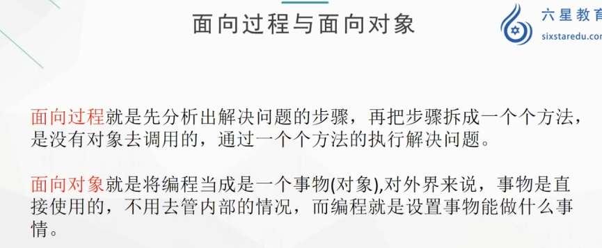

面向对象和面向过程的区别：

面向过程（手洗）：需要实现一个功能的时候，着重的是过程，分析出一个个步骤，并把一个个步骤用一个个函数实现，再依次去调用一个个函数即可（每一个步骤都需要自己亲力亲为

面向对象（机洗）：需要实现一个功能的时候，看重的是谁去帮我做这件事情（偷懒，找别人帮我做）

### **<mark>类和对象</mark>**

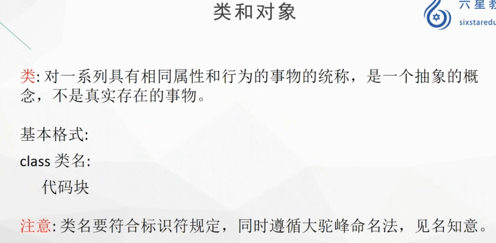

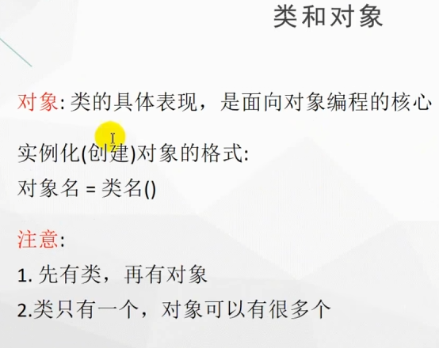

```
#洗衣机类
class Washer:
    height =800  #类属性：就是类所拥有的属性
# 查看类属性：类名.属性名
print(Washer.height)
#新增类属性：类名.属性名=值
Washer.width =450
```

#### **创建对象**

创建对象的过程也叫做实例化对象

实例化对象的基本格式：对象名=类名()

```
#实例化一个洗衣机对象
wa=Washer()
print(wa)  #显示的对象在内存中的地址
# 第二次实例化
wa2 = Washer()
print (wa2)
#内存地址不一样，说明是不同的对象，可以实例化多个对象
```

#### **实例方法和实例属性**

实例方法：由对象调用，至少有一个self参数，执行实例方法的时候，自动将调用该方法的对象赋值给self

```
class Washer:
    height =800  #类属性
    def wash(self): #self参数是类中的实例方法必须具备的
                    #self表示当前调用的对象本身
                    #self不是 Python 的关键字，只是一个约定俗成的名字。
        print(”我会洗衣服”）
# 实例化对象
wa=Washer() #Python会自动转换成：Washer.wash(wa)，也就是说，self接收到的就是wa 
这个对象。
#对象调用方法
wa.wash()
```

实例属性

格式：self.属性名

```
class Person:
      name='bingbing'   #类属性
      def introduce(self): #实例方法
          print（”我是实例方法"）
          print(f"{Person.name}的年龄:{self.age}") #self.age是实例属性
pe=Person()
pe.age=18
pe.sex='女' #实例属性
print(pe.sex)  #根据对象名访问实例属性
pe.introduce() 
#访问类属性，类可以访问到，实例对象也可以访问到
print(Person.name)
print(pe.name)
```

实例属性和类属性的区别

类属性属于类，是公共的，大家都能访问到，实例属性属于对象的，是私有的

实例属性只能由对象名访问，不能由类名访问

### **<mark>构造函数\_\_init\_\_(self)</mark>**

作用：通常用来做属性初始化或者赋值操作 

注意：在类实例化对象的时候，会被自动调用

```
class Test:
    def __init__(self): #self--实例方法
        print("这是__init__()函数")
te=Test()
```

```
class Person #人类
    def__init(self,name,age,height):  #带参的构造函数
        self.name = name  # 姓名  用参数构造实例属性（方便每次调构造函数时传不同的值）
        self.age = age    # 年龄
        self.height =height # 身高

#实例化对象
pe=Person('bingbing',18，183)
```

### **<mark>析构函数\_\_del\_\_()</mark>**

作用：删除对象的时候，解释器会默认调用_del_()方法

```
class Person:
    def __init__(self):  #注意：def后面有个空格再接内容
        print("我是__init__()")
    def __del__(self):
        print("被销毁了")
p=Person()
#del p 删除p这个对象
#del p语句执行的时候，内存会立即被回收，会调用对象本身的__del__()方法
print("这是最后一行代码")
#正常运行时，不会调用__de1__()，对象执行结束之后，系统会自动调用__del__()
#__del__()主要是表示该程序块或者函数已经全部执行结束。
```

### **<mark>封装</mark>**

面向对象的三大特性：封装、继承、多态

| 形式       | 名称   | 作用     | 外部访问 |
| -------- | ---- | ------ | ---- |
| `name`   | 普通属性 | 公开使用   | 可以   |
| `_name`  | 隐藏属性 | 提醒内部使用 | 可以   |
| `__name` | 私有属性 | 防止直接访问 | 不能直接 |

封装思想：

> 不让外部直接操作内部数据，而通过规定的方法访问。

| 方式              | 是不是封装          |
| --------------- | -------------- |
| 把代码放进函数 `def` 中 | ✅ 广义的代码封装      |
| 把属性和方法放进类中      | ✅ 面向对象封装（主要含义） |
| 使用 `__属性` 隐藏数据  | ✅ 封装的一种实现      |

封装：将复杂的信息、流程给包起来，内部处理，让使用者只需要通过简单的操作步骤，就能实现。指的是隐藏对象中一些不希望被外部所访问到的属性或者方法

**<u>私有属性</u>**，只允许在类的内部使用，无法通过对象访问
在属性名或者方法名前面加上两个下划线

```
class Person:
    name ='James'  #类属性
    __age =28  #隐藏属性
    def introduce（self):  # 实例方法
        print(f”{Person.name}的年龄是{Person.__age}"）
        #在实例方法种访问类属性和隐藏属性
pe=Person()
print(pe. name)
print (pe.age)  #访问报错
#隐藏属性访问和修改的方法
# 第一种方式：了解
#隐藏属性实际上是将名字修改为：_类名__属性名 _Person__age
print(pe._Person__age)   #访问成功
pe._Person__age =18      #修改成功
print(pe._Person__age)
第二种方式：在类的内部访问  ----推荐使用，正规手段
pe.introduce()
```

#### **隐藏属性/方法**

1.xxx：普通属性/方法，如果是类中定义的，则类可以在任意地方使用
2._xxx：单下划线开头，声明隐藏属性/方法，如果定义在类中，外部可以使用，子类也可以继承
                但是在另一个py文件中通过from  xxx    import\*导入时，无法导入
                一般是为了避免与Python关键字冲突而采用的命名方法
3.___xxx:双下划线开头，私有

属性，如果定义在类中，无法在外部直接访问，子类不会继承，
要访问只能通过间接的方式，另一个py文件中通过from    xxx     import\*导入的时候，也无法导入

```
class Person:
    name ='James'  #类属性
    _age =28  #隐藏属性
pe=Person()
print(pe. name) 
print (pe._age)  
#James
#28
```

```
class Man:
    def __play(self):  #私有方法
        print('玩手机')
    def funa(self):    #平平无奇的实例方法
        print（”平平无奇的实例方法”）
        self.__play()  # 推荐使用，更简便
ma=Man()
ma.funa()
```

### **<mark>继承</mark>**

继承：指的是多个类之间的所属关系，即子类默认继承父类的所有属性和方法。

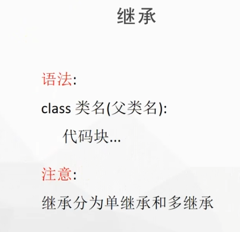

#### **单继承**

```
class Person:   #父类
    def eat(self):
        print（”我会吃饭”）
    def sing(self):
        print(我是唱歌小能手"）
class Girl(Person):  #Person类的子类
    pass   #占位符，代码里面类下面不写任何东西，会自动跳过
girl=Gril()
girl.eat()
girl.sing()
#总结：子类可以继承父类的属性和方法，就算子类自己没有，也可以使用父类的。
```

#### **继承的传递（多重继承）**

A/B/C.            C.(子类）继承于B（父类），B类（子类)继承A类（父类），C类具有A/B类的属性和方法

```
class Father：   #父类
    def eat(self):
        print(”吃饭")
    def sleep(self);
        print ("睡觉”)
class Son(Father)：    #Father类的子类
    pass
class Grandson(Son):   #Son的子类
    pass
son=Son()
son.eat()
son.sleep()
grandson=Grandson
grandson.eat()
grandson.sleep()
#继承的传递性就是子类拥有父类以及父类的父类中的属性和方法
```

### **<mark>方法的重写</mark>**

重写指在子类中定义与父类相同名称的方法

#### **覆盖父类方法**

```
class Person:    #父类
    def money(self):
        print（”一百万需要被继承”)
class Man(Person）:   #子类
    def money(self):
        print（”自己赚一千万”)
man=Man()
man.money()  #自己赚一千万
```

#### **对父类方法进行扩展：继承父类的方法，子类也可以增加自己的功能**

```
#1.父类名.方法名（self）
#2.super().方法名----推荐使用
#3.super(子类名，self).方法名()
#super在python里面是一个特殊的类，super()是使用super类创建出来的对象，可以调用父类
中的方法
class Person:    #父类
    def money(self):
        print（”一百万需要被继承”)
    def sleep(self):
        print("睡觉了")
class Man(Person）:   #子类
    def money(self):
        Person.money(self)  #第一种方法
        super().sleep()   #第二种方法
        super(Man,self).money()  #第三种方法 
        print（”自己赚一千万”)
man=Man()
man.money()  #自己赚一千万
```

- **类名调用方法：**
  
  ```
  Person.sleep(self)
  ```
  
  → 需要自己传 `self`

- **对象调用方法：**
  
  ```
  man.sleep()
  ```
  
  → Python自动传 `self`

Python 3 中所有类都是新式类，新式类本质上就是继承自 object 的类Python 3 中所有类都是新式类，新式类本质上就是继承自 object 的类

继承了父类的子类，就是派生类

object--对象，python为所有对象提供基类（顶级父类），提供了一些内置的属性和方法，可以使用dir（）查看

### <mark>**多继承**</mark>

子类可以拥有多个父类，并且具有所有父类的属性和方法

多继承的弊端：

- 容易引发冲突

- 会导致代码设计的复杂度增加

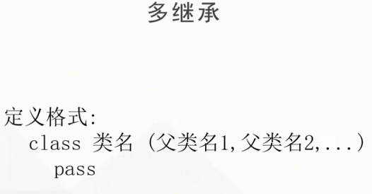

```
class Father(object):   #父类一
    def money(self):
        print（"拥有一百万财产需要被继承"）
class Mother(object):   #父类二
    def appearance(self):
        print（"绝世容颜需要被继承"）
class Son(Father,Mother):   #子类
    pass
son=Son()
son.money()
son.apperance()
```

不同的父类存在同名的方法:开发时，需要尽量避免这种情况

有多个父类的属性和方法,如果多个父类具有同名方法的时候，调用就近原则，如class Son(Father,Mother)，会优先调用Father类中的同名方法

#### **方法的搜索顺序（了解）**

python中内置的属性___mro__可以查看方法搜索顺序

```
#接上一个代码块
print(Son.__mro__)
#搜索方法时，会先按照__mro__的输出结果，从左往右的顺序查找。
```

### **<mark>多态</mark>**

指同一种行为具有不同的表现形式 

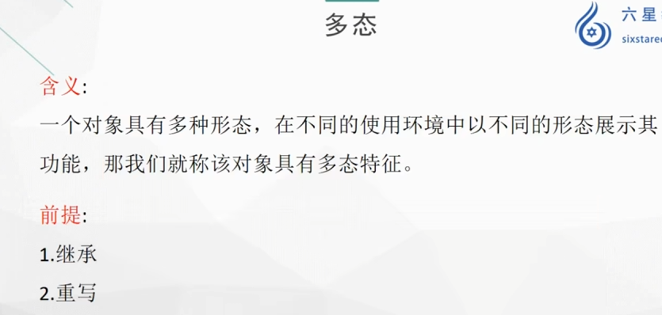

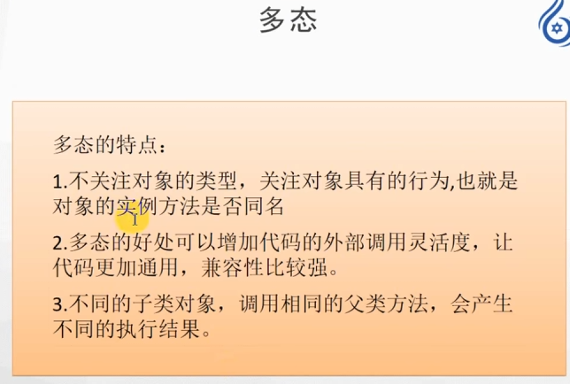

```
print(10+10)   #算术运算符：可以实现整型之间的相加操作
print(’10’+’10’)  #字符串拼接：实现字符串之间的拼接操作
#这也算多态的一种体现
```

```
class Animal(object):
    “””父类：动物类”””
    def shout (self):
        print（"动物会叫”)
class Cat(Animal)：
    """子类一：猫类"""
    def shout(self):
        print(小猫喵喵喵″）
class Dog (Animal):
    “"”子类二：狗类”””
    def shout(self):
        print（"小狗汪汪汪”)
cat=Cat()
cat. shout()
dog = Dog()
dog. shout()
```

多态性:一种调用方式，不同的执行结果（定义一个统一的接口，一个接口多种实现）                     

```
class Animal(object):
    def eat(self):
        print("a")
class Pig(Animal):
    def eat(self):
        print("b")
class Dog(Animal):
    def eat(self):
        print("c")
def test(obj):
    obj.eat()
animal=Animal()
pig = Pig()
dog = Dog()
test(animal)
test(pig)
test(dog)  
#test函数传入不同的对象，执行不同对象的eat方法
```

### **<mark>静态方法</mark>**

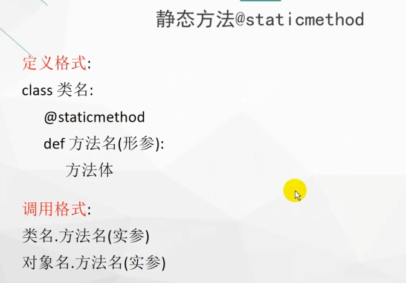

使用@staticmethod来进行修饰，静态方法没有self，cls参数的限制
静态方法与类无关，可以被转换成函数使用

```
class Person(object):
    @staticmethod   #静态方法
    def study():
        print("人类会学习”）
#静态方法既可以使用对象访问，也可以使用类访问
Person.study()
pe=Person
pe.study()
```

| 类型   | 第一个参数  | 能访问什么 | 调用方式      |
| ---- | ------ | ----- | --------- |
| 实例方法 | `self` | 对象属性  | `对象.方法()` |
| 类方法  | `cls`  | 类属性   | `类名.方法()` |
| 静态方法 | 无      | 普通变量  | `类名.方法()` |

Python中的**静态方法（staticmethod）**主要作用是：

> **把一个与类相关、但不需要访问类属性和实例属性的方法放在类里面管理。**
> 
> 同时取消不必要的参数传递，有利于减少不必要的内存占用和性能消耗

简单理解：

- 普通方法需要 `self`，操作对象的数据
- 类方法需要 `cls`，操作类的数据 
- 静态方法既不需要 `self`，也不需要 `cls`

### **<mark>类方法</mark>**

使用装饰器@classmethod来标识为类方法，对于类方法，第一个参数必须是类对象，一般是以cls作为第一个参数

```
#定义格式
class 类名:
    @classmethod
    def 方法名(cls,形参):
        方法体
```

```
class Person(object):
    name='bingbing'
    @classmethod
    def sleep(cls):
        print(cls)  #c1s代表类对象本身，类本质上就是一个对象
        print（"人类在睡觉")
        print(cls.name)    #相当于print(Person.name)
Person.sleep()   #相当于Person.sleep(Person)
#当方法中需要使用到类对象（如访问私有类属性等），定义类方法
#类方法一般是配合类属性使用
```

#### **方法总结：**

三种方法本质上都是定义在类中的函数

 实例方法（instance method）

特点：

- 第一个参数是 `self`

- 自动接收对象
  
  类方法（classmethod）

特点：

- 第一个参数是 `cls`

- 自动接收类对象
4. 静态方法（staticmethod）

特点：即类中的普通函数

| 方法类型 | 实例属性   | 类属性    | 自动获得   |
| ---- | ------ | ------ | ------ |
| 实例方法 | ✅ 可以   | ✅ 可以   | `self` |
| 类方法  | ❌ 不能直接 | ✅ 可以   | `cls`  |
| 静态方法 | ❌ 不能直接 | ❌ 不能直接 | 无      |

静态方法可以通过类名访问类属性，通过对象访问实例属性

类方法通过手动传入对象，可以访问实例属性

### **<mark>\_\_init\_\_()和\_\_new\_\_()</mark>**

|      | **new**   | **init**  |
| ---- | --------- | --------- |
| 作用   | 创建对象      | 初始化对象     |
| 执行时间 | 先执行       | 后执行       |
| 参数   | cls       | self      |
| 返回值  | 必须返回对象    | 不能返回对象    |
| 调用次数 | 每创建对象一次调用 | 每创建对象一次调用 |

```
class Person:
    pass
p = Person()
```

> **`Person()` 创建的对象，本质上就是 `__new__()` 创建的对象，只不过 Python 在创建后又自动调用了 `__init__()` 进行初始化。**

```
#__init__():初始化对象,给对象设置初始属性
class Test(object):
    def_init_(self):
        print(”这是__init__()")
te = Test()
```

```
#__new__()：object基类提供的内置的静态方法,它是在 __init__() 之前执行的。
#作用：1.在内存中为对象分配空间2.返回对象的引用
```

```
class Test(object):
    def __init__(self):
        print("这是__init__()")
        # print(self)
    def __new__(cls,*args,**kwargs):  #cls代表类本身
        print("我是__new__()")
        print(cls)
    #对父类方法进行扩展 super().方法名()
    res=super().__new__(cls)   #方法重写，res里面保存的是实例对象的引用，
    #__new__()是静态方法，形参里面有cls，实参就必须传cls
     return res
#注意：重写__new__()一定要return super().__new__（cls），否则python解释器得不到
分配空间的对象引用，就不会调用__init()    
te=Test()
```

#### **一个对象的实例化过程：**

首先执行\_\_new\_\_()，如果没有写\_\_new\_\_()，默认调用object里面的\_\_new\_\_()，返回一个实例对象，然后再去调用\_\_init\_\_()

### **<mark>类型</mark>**

```
class Test:
    pass
te=Test()
print(te) 
print(Test)  
#<__main__.Test object at 0x0000020D72B63770> 
<class '__main__.Test'>  
#print(实例) 默认显示地址
print(类) 默认显示 <class '类名'>
其实类对象也有标识信息，只是 print(Test) 时 Python 默认没有把它显示出来。
```

| 对象      | type()结果 |
| ------- | -------- |
| `10`    | `int`    |
| `"abc"` | `str`    |
| `te`    | `Test`   |
| `Test`  | `type`   |
| `type`  | `type`   |

实例的类型 = 创建它的类

**<u>类的类型 </u>**= 创建这个类的元类

普通 Python 类的默认元类就是 `type`

```
print(type(int)) 
print(type(str))  
#<class 'type'>
<class 'type'>
```

### **<mark>所有类型的空值</mark>**

| 类型   | 空值写法        | 类型         | 示例              |
| ---- | ----------- | ---------- | --------------- |
| 空字符串 | `""` 或 `''` | `str`      | `s = ""`        |
| 空列表  | `[]`        | `list`     | `lst = []`      |
| 空元组  | `()`        | `tuple`    | `t = ()`        |
| 空字典  | `{}`        | `dict`     | `d = {}`        |
| 空集合  | `set()`     | `set`      | `s = set()`     |
| 空字节串 | `b""`       | `bytes`    | `b = b""`       |
| 空范围  | `range(0)`  | `range`    | `r = range(0)`  |
| 空迭代器 | `iter([])`  | `iterator` | `it = iter([])` |
| 空值对象 | `None`      | `NoneType` | `x = None`      |

空值对象表示：

> **“没有值”或者“没有对象”**

None 是一个真正的对象，它只有一个值，且不等于 0、空字符串、空列表

None 的常见用途：

1. 表示没有结果

2. 作为变量初始值

3. 函数没有返回值时

```
None 的常见用途：
1. 表示没有结果 
def find_user():
    return None 
2. 作为变量初始值
name = None
# 后面再赋值
name = "张三"  
3. 函数没有返回值时
def test():
    print("hello") 
a = test()   #这一步会调用一次test()
print(a)
```

在 Python 中：

> 如果一个函数没有明确返回值，Python 会默认返回 `None`。

### **<mark>字节串</mark>**

字节串写法：

1. b""：`b""` 是直接写字节，只支持 ASCII

2. "字符".encode("utf-8")

3. 整数列表转换：例如b = bytes([65,66,67])

4. 创建指定长度的空字节：例如：b = bytes(5)

字节串的类型为bytes，bytes 本质存的是字节，不是字符

保存的是**二进制字节数据**

```
字节数据：0~255之间的数字
一个字节（byte）由 **8个二进制位bit**组成：
为什么说范围是 0~255？
因为 8 个二进制位可以表示：
00000000到：11111111
```

UTF-8规则：

| 字符范围             | 占用字节 |
| ---------------- | ---- |
| 英文、数字、部分符号       | 1字节  |
| 欧洲部分文字           | 2字节  |
| 中文等常见字符          | 3字节  |
| 部分特殊字符（如很多emoji） | 4字节  |

UTF-8 会把字符转换成一个由多个 0～255 数字组成的字节序列，而不是把每个字符简单转换成一个 0～255 的数字。

### **<mark>单例模式</mark>**

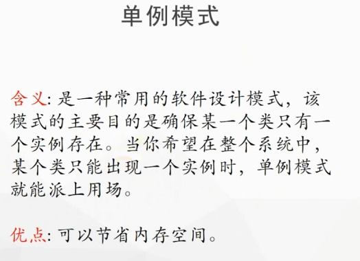

 弊端：多线程访问的时候容易引发线程安全问题

#### **方式：**

1. 通过@classmethod

2. 通过装饰器实现

3. 通过重写\_\_new\_\_实现（重点）

4. 通过导入模块实现

#### **通过重写__new__实现**

```
class Singleton(object):  #记录第一个被创建的对象的引用
    obj = None #类属性
    def __new__(cls,*args,**kwargs):
        print("这是__new__()方法")
        if cls.obj==None:
            cls.obj = super().__new__(cls)  #创建一个空的 Singleton 实例对象，
并返回它的引用。此时cls.obj指向这个Singleton 实例对象
        return cls.obj  #cls.obj不为空，直接返回第一个被创建的对象的引用
    def __init__(self):
        print("我是__init__()")
s=Singleton()
print("s:",s)
s2=Singleton()
print("s:",s2)
```

**<u>类属性只有在定义类的时候执行一次，创建实例阶段不会再次执行</u>**

| 情况                     | 是否调用 `super().__new__(cls)` |
| ---------------------- | --------------------------- |
| 普通类重写 `__new__()`      | 通常需要                        |
| 单例模式                   | 通常需要                        |
| 继承不可变类型（int、str、tuple） | 可能调用父类对应的 `__new__()`       |
| 想返回已有对象                | 不一定                         |
| 想阻止对象创建                | 不需要                         |

先记住：

> **`super().__new__(cls)` 就是调用父类的 `__new__()` 方法，让 Python 帮我们创建一个对象。**

#### **通过导入模块实现**

模块就是天然的单例模式

原因是：

> **Python 的模块（module）在程序运行期间只会被加载一次。**

第一次 `import` 时，Python 会执行模块代码并创建模块对象；之后再次 `import`，会直接使用已经加载好的模块对象。

```
#假设有一个文件：
#singleton.py
class Singleton:
    def __init__(self):
        self.name = "单例对象"

obj = Singleton()
#在其他文件导入时都会拿到同一个对象
```

应用场景

1. 回收站对象

2. 音乐播放器，一个音乐播放软件负责音乐播放的对象只有一个

3. 开发游戏软件      场景管理器

4. 数据库配置、数据库连接池的设计

### **<mark>魔法方法</mark>**

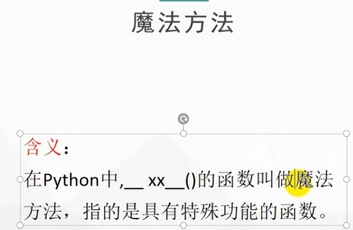

| 名称              | 类型   | 是否带括号 | 作用                      | 示例                           |
| --------------- | ---- | ----- | ----------------------- | ---------------------------- |
| `__new__()`     | 特殊方法 | ✅带括号  | 创建对象，在内存中为对象分配空间并返回对象引用 | `obj = super().__new__(cls)` |
| `__init__()`    | 特殊方法 | ✅带括号  | 初始化对象，对对象属性进行赋值         | `def __init__(self):`        |
| `__str__()`     | 特殊方法 | ✅带括号  | 定义对象转换成字符串时的显示内容        | `print(obj)`                 |
| `__repr__()`    | 特殊方法 | ✅带括号  | 定义对象的官方字符串表示，方便调试       | `repr(obj)`                  |
| `__del__()`     | 特殊方法 | ✅带括号  | 对象被销毁时调用（析构方法）          | `def __del__(self):`         |
| `__call__()`    | 特殊方法 | ✅带括号  | 让对象可以像函数一样调用            | `obj()`                      |
| `__len__()`     | 特殊方法 | ✅带括号  | 定义对象长度                  | `len(obj)`                   |
| `__getitem__()` | 特殊方法 | ✅带括号  | 支持通过下标访问                | `obj[0]`                     |
| `__setitem__()` | 特殊方法 | ✅带括号  | 支持通过下标赋值                | `obj[0]=10`                  |
| `__iter__()`    | 特殊方法 | ✅带括号  | 定义对象的迭代行为               | `for x in obj`               |
| `__next__()`    | 特殊方法 | ✅带括号  | 定义迭代器下一次取值              | `next(obj)`                  |

Python 常见特殊属性（不带括号）

| 名称           | 类型   | 是否带括号 | 作用             | 示例                  |
| ------------ | ---- | ----- | -------------- | ------------------- |
| `__doc__`    | 特殊属性 | ❌不带括号 | 获取类、函数、模块的说明文档 | `Person.__doc__`    |
| `__module__` | 特殊属性 | ❌不带括号 | 获取当前类所属模块      | `Person.__module__` |
| `__class__`  | 特殊属性 | ❌不带括号 | 获取对象所属的类       | `p.__class__`       |
| `__dict__`   | 特殊属性 | ❌不带括号 | 获取对象或类的属性字典    | `p.__dict__`        |
| `__name__`   | 特殊属性 | ❌不带括号 | 获取类、函数、模块名称    | `Person.__name__`   |
| `__bases__`  | 特殊属性 | ❌不带括号 | 获取类的父类         | `Person.__bases__`  |

#### **\_\_doc\_\_：类、函数的描述信息**

类的描述信息在类中会用三引号包起来

```
class Person(object):
    """人类---类的描述信息"""
    pass
print(Person.__doc__) #人类---类的描述信息
```

#### **\_\_str\_\_():对象的描述信息**

如果类中定义了此方法，那么在打印对象时，默认输出该方法的返回值，也就是打印方法中return的数据

<u>注意：</u>\_\_str\_\_()必须返回一个字符串

#### **\_\_call\_\_()：使一个实例对象成为一个可调用对象，就像函数那样可以调用**

可调用对象：函数\内置函数和类都是可调用对象，凡是可以把一对()应用到某个对象身上都可以称之为可调用对象

callable()：判度一个对象是否是可调用对象

```
class C:
    def __str__(self):
    # return”这里是str的返回值”    #必须要有返回值，并且一定是字符串类型
    return 123
    # pass
c=C()
print(c)
```

### **<mark>文件基础操作</mark>**

文件就是存储在某种长期储存设备上的一段数据

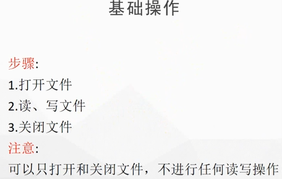

#### **文件对象的方法**

1. open()：创建一个file对象，默认是以只读模式打开
   
   f=open('位置+文件名')

2. read(n)：n表示从文件中读取的数据的长度，没有传n值就默认一次性读取文件的所有内容
   
   print(f.read())

3. write()：将指定内容写入文件

4. close()：关闭文件
   
   f.close()

#### **属性**

1. 文件名.name：返回要打开的文件的文件名，可以包含文件的具体路径

2. 文件名.mode：返回文件的访问模式

3. 文件名.closed：检测文件是否关闭，关闭就返回True

#### **读写操作**

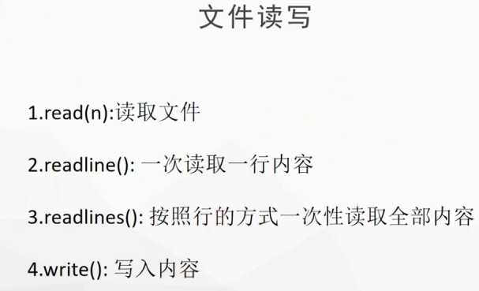

readline()：一次读取一行内容，方法执行完，会把文件指针移到下一行，准备再次读取

print(f.readline())

readlines0：按照行的方式把文件内容一次性读取，返回的是一个列表，每一行的数据就是列表中的一个元素

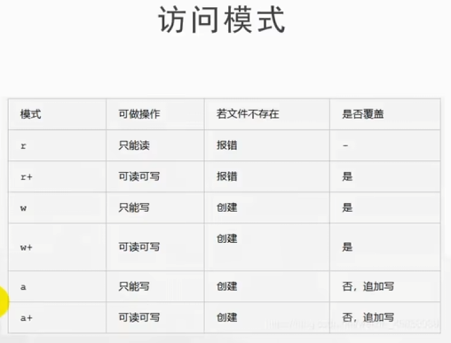

```
#使用格式
f=open('文件名','a') #在后面添加模式
```

第一个模式是r（只读模式），第二个模式是r+

只读模式是默认模式、

w：只写模式，文件存在就会先清空文件内容，再写入添加内容，不存在就创建新文件

+：表示可以同时读写某个文件

使用+会影响文件的读写效率，开发过程中更多时候会以只读、只写的方式来操作文件

a：追加模式，不存在就创建新文件进行写入，存在则在原有内容的基础上追加新的内容

文件指针：标记从哪个位置开始读取数据（不是光标）

#### **文件定位操作**

tell()：显示文件内当前位置，即文件指针当前位置

pos=f.tell()

seek(offset,whence): 移动文件读取指针到指定位置

offset：偏移量，表示要移动的字节数

whence：起始位置，表示移动字节的参考位置，默认是0，0代表文件开头作为参考位置，1代表当前位置作为参考位置，2表示将文件结尾作为参考位置

seek(0,0)就会把文件指针移到文件开头

#### **编码格式**

with open

作用：代码执行完，系统会自动调用f.close()，可以省略文件关闭步骤

```
with open('test.txt','w') as f:    #f是文件对象
    f. write("emmmmm....") 
print(f.closed))    #True
```

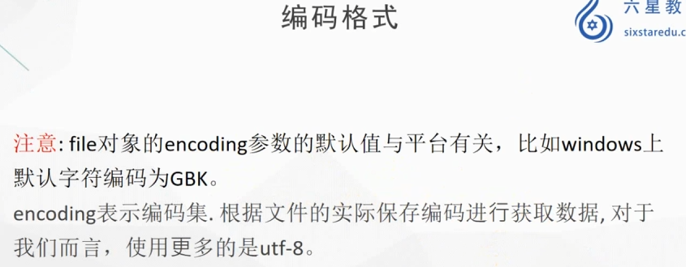

案例：图片复制     'rb'模式   r:read    b:binary（二进制）

1. 读取图片
   
   图片是一个二进制文件，想要写入必须要先拿到

2. 写入图片

```
with open("D:\onedrive\Desktop\新建文件夹\图片.jpg",'rb')as file:
    img=file.read()
    print(img)
with open('D:\python\PythonProject1\图片.jpg','wb')as f:
    f.write(img)
```

#### **日常录用操作**

 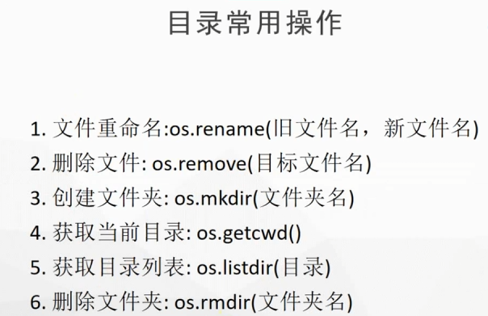

在进行目录常用操作之前需要导入模块：import os 

print (os.listdir('../')）#获取上一级目录的列表,括号内为空的话就是获取当前目录列表

### **<mark>迭代器</mark>**

可迭代对象：iterable

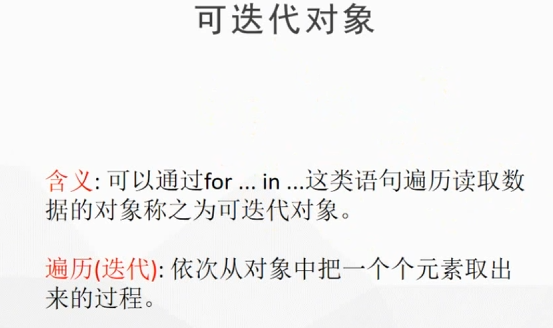

| 类型        | 是否可迭代 |
| --------- | ----- |
| list（列表）  | ✅     |
| tuple（元组） | ✅     |
| str（字符串）  | ✅     |
| dict（字典）  | ✅     |
| set（集合）   | ✅     |
| range     | ✅     |
| 文件对象      | ✅     |
| int（整数）   | ❌     |

可迭代对象的条件：

1. 对象实现了\_\_iter\_\_()方法

2. \_\_iter\_\_()方法返回了迭代器对象

for循环工作原理

1. 先通过\_\_iter\_\_()获取可迭代对象的迭代器

2. 对获取到的迭代器不断调用\_\_next\_\_()方法来获取下一个值并将其赋值给临时变量i

isinstance():判度一个对象是否是可迭代对象或者是一个已知的数据类型

```
#isinstance(o,t)  o：对象，t：类型，可以是直接或者间接类名、基本类型或者元组
from collections.abc import Iterable
print(isinstance(123,Iterable))  #False
```

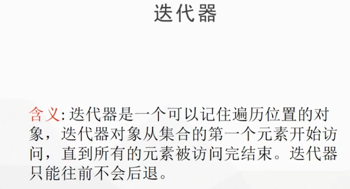

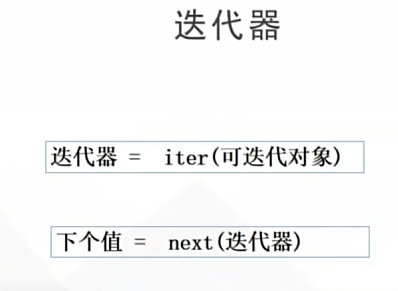

迭代器(Iterator)是一个可以记住遍历位置的对象：在上次停留的位置继续去做一些事情

iter()：获取可迭代对象的迭代器，即把一个可迭代对象转换成迭代器对象。

next()：一个个去取元素，取完元素后会引发一个异常

**在 Python 中，每个迭代器对象都必须具有 `__iter__()` 和 `__next__()` 两个方法**。

```
li=[1,2,3,4,5]
#创建迭代器对象
li2=iter(li)
print(li2)
#获取下一条数据
print(next(li2))
print(next(li2))
#取完元素后，再使用next()会引发StopIteration异常
```

步骤：

1. iter()调用对象的\_\_iter\_\_()，并把\_\_iter\_\_()方法的返回结果作为自己的返回值

2. next()调用对象的\_\_next__()，一个个取元素

3. 所有元素都取完了,__next__()将引发StopIteration异常

可迭代对象iterable和迭代器iterator

> **可迭代对象：能被 `for` 遍历的对象。**  
> **迭代器对象：真正负责一个一个取出元素的对象。**

可以理解为：

- 可迭代对象 = **一个数据集合**

- 迭代器对象 = **访问这个集合的工具**
  
  凡是可以作用于for循环的都属于可迭代对象
  凡是可以作用于next()的都是迭代器

```
from collections.abc import Iterable,Iterator
name='bingbing'
print(isinstance(name,Iterable)) # True
print(isinstance(name,Iterator))  # False
#可迭代对象并不一定是迭代器对象
name2=iter(name)  #将name转换成迭代器对象
print(isinstance(name2,Iterable))    # True
print(isinstance(name2,Iterator))    # True
#迭代器对象一定是可迭代对象
# 总结：
#可迭代对象可以通过iter()转换成迭代器对象
#如果一个对象拥有__iter__()，是可迭代对象，如果一个对象拥有__next__()和__iter__()
方法，是迭代器对象
#dir()：查看对象中的属性和方法
```

#### **迭代器协议**

对象必须提供一个next方法，执行该方法要么就返回迭代中的下一项，要么就引发StopIteration异常，来终止迭代

#### **自定义迭代器类**

```
class MyIterator(object):
    def __init__(self):
        self.num =0
    def __iter__(self):
        return self    #返回的是当前迭代器类的实例对象
    def __next__(self):
        if self.num == 10:
            raise StopIteration(”终止迭代，数据已经被取完了”）
        self.num += 1
        return self.num
mi=MyIteratorO
print(mi)
```

### **<mark>生成器</mark>**

Python中一边循环一边计算的机制，叫做生成器

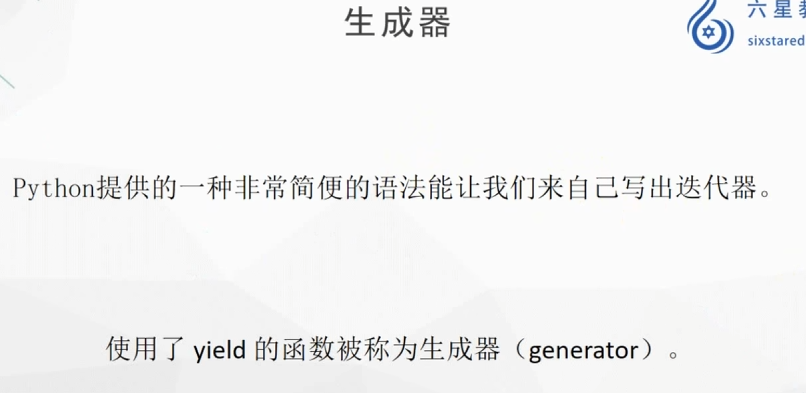

yield的作用：

1. 类似return，将指定值或者多个值返回给调用者,yield返回的结果可以是任意Python对象

2. yield语句一次返回一个结果（对象），在每个结果中间，挂起函数，执行next()，再重新从挂起点继续往下执行
   是函数中断，并保存中断的状态

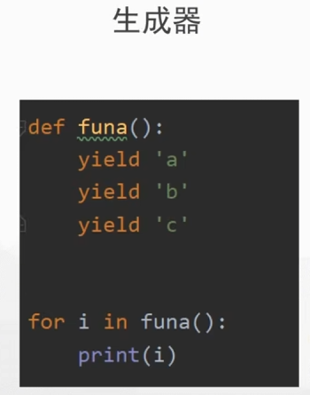

```
# 列表推导式
# for i in range(5):
#print(i*5)
li=[i*5 for iin range(5)]
gen=(i*5 for i in range(5))  #列表推导式的[]改成()就成了生成器表达式
print(li)
print(gen)
```

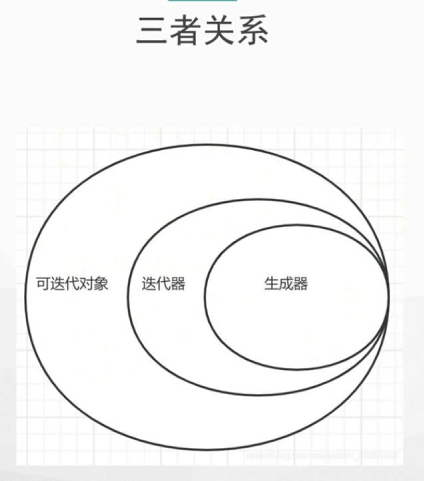

三者关系总结

可迭代对象：指实现了python迭代协议，可以通过for...in..循环遍历的对象，比如list、dict、str...、迭代器、生成器
迭代器：可以记住自己遍历位置的对象，直观体现就是可以使用next()函数返回值，迭代器只能往前，不能往后，当遍历完毕之后，next()会抛出异常

生成器：是特殊的迭代器，需要注意迭代器并不一定是生成器，它是python提供的通过简便的方法写出迭代器的一种手段

### **<mark>线程</mark>**

#### **多任务**

```
import time
def sing():
    print（"我在唱歌")
    time.sleep(2)   #睡眠，以秒为单位
    print（"唱完歌了"）
def dance():
    print(”在跳舞”)
    time.sleep(2)
    print("跳完舞了")
sing()
dance()
```

#### **多线程**

多线程：同时运行多个线程

##### **线程和进程**

进程：是操作系统进行资源分配的基本单位，每打开一个程序至少就会有一个进程。
线程：是cpu调度的基本单位，每一个进程至少都会有一个线程，这个线程通常就是我们所说的主线程

一个进程默认有一个线程，进程里面可以创建多个线程，线程是依附在进程里面的，没有进程就没有线程。

```
#导入线程模块
import threading
import time
#Thread线程类参数
#target:执行的任务名
#args：以元组的形式给任务传参
#kwargs：以字典的形式给任务传参
def sing(name):
    print(f"{name}在唱歌")
    time.sleep(2)
    print("唱完歌了")
def dance():
    print("在跳舞")
    time.sleep(2)
    print("跳完舞了")
#主程序入口
if __name__=='__main__':
    # 1.创建子线程
    t1= threading.Thread(target=sing,args=('bingbing',))  #以元组的形式传参，
末尾要加一个逗号
    t2= threading. Thread(target=dance)
    # 3.守护线程，必须放在start前面：主线程执行结束，子线程也会跟着结束
    t1.daemon=True
    t2.daemon=True
    # 2.开启子线程
    t1. start()
    t2. start()
    # 4.阻塞主线程join()：暂停的作用，等子线程执行结束后，主线程才会继续执行，
必须放在start()后面
    t1.join()
    t2.join()
    # 5.获取线程名
    print(t1.name)
    print(t2.name)
    # 6.更改线程名
    t1.name='子线程一'
    t2.name='子线程二'
    print(t1.name)
    print(t2.name)
    print("完美谢幕，本次表演结束")
```

 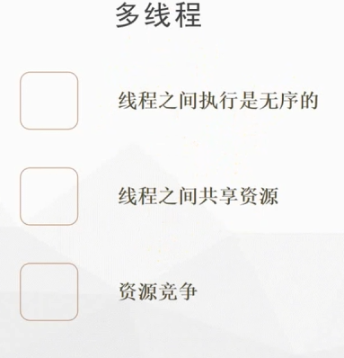

线程之间执行是无序的

线程之间是根据cpu调度决定的

```
def task():
    time.sleep(1)
    print（"当前线程是：“threading.current_thread(.name)  #显示当前线程对象名
if __name__=="__main__":
    for i in range(5):
        #每循环一次就创建一个子线程
        t = threading.Thread(target=task)
        # 启动子线程
        t.start()
```

`if __name__ == "__main__":` 的作用是：

> **判断当前 Python 文件是不是被直接运行，如果是，就执行下面的代码；如果是被其他文件导入，则不执行。**

线程之间共享资源

```
li=[]  #定义全局变量
#写入数据
def wdata():
    for i in range(5):
        li. append (i)
        time.sleep(1)
    print(”写入的数据是：”,1i)
#读取数据
def rdata():
    print（”读取的数据是：”,1i)
if __name__=='__main__'
    #创建子线程
    wd = threading.Thread(target=wdata)
    rd = threading.Thread(target=rdata)
    #开启子线程
    wd.start()
    wd.join()
    rd.start()
    rd.join()
```

 资源竞争

```
import threading
a=0
b=1000000
def add():
    for i in range (b):
        global a
        a+=1
    print('第一次累加:',a)
def add2():
    for i in range (b):
        global  a
        a+=1
    print('第二次累加:',a)
if __name__ == '__main__':
    a1=threading.Thread(target=add)
    a2=threading.Thread(target=add2)
    a1.start()
    a2.start()
```

#### **线程同步**

主线程和创建的子线程之间各自执行完自己的代码直至结束

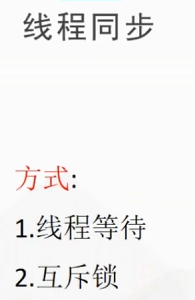

##### **线程等待**

```
import threading

a=0
b=1000000
def add():
    for i in range (b):
        global a
        a+=1
    print('第一次累加:',a)
def add2():
    for i in range (b):
        global  a
        a+=1
    print('第二次累加:',a)
if __name__ == '__main__':
    a1=threading.Thread(target=add)
    a2=threading.Thread(target=add2)
    a1.start()
    a1.join()  #等待a1子线程执行结束以后，代码再继续往下运行，开始执行a2子线程
    a2.start()
    a2.join()
```

##### **互斥锁**

互斥锁是多个线程一起去抢，抢到锁的线程先执行

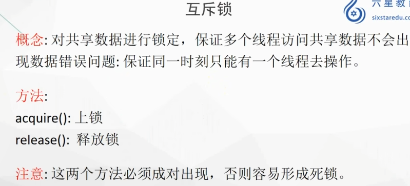

死锁：一直等待对方释放锁的情景就是死锁，会造成应用程序停止响应，不能再处理其他任务

互斥锁的缺点：会影响代码的执行效率

```
import threading
from _thread import lock
#1.创建全局互斥锁
lock = threading.Lock()
a=0
b=1000000
def add():
    #2.上锁
    lock.acquire()
    for i in range (b):
        global a
        a+=1
    print('第一次累加:',a)
    #3.释放锁
    lock.release()
def add2():
    lock.acquire()
    for i in range (b):
        global  a
        a+=1
    print('第二次累加:',a)
    lock.release()
if __name__ == '__main__':
    a1=threading.Thread(target=add)
    a2=threading.Thread(target=add2)
    a1.start()
    a2.start()
```

### **<mark>进程</mark>**

进程间不共享全局变量

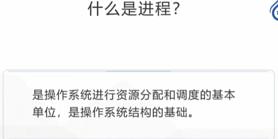

一个正在运行的程序或者软件就是一个进程

一个程序运行起来后，会变成一个进程；一个进程里面可以包含多个线程。

注意：进程里面可以创建多个线程，多进程也可以完成多任务

#### **进程的状态**

1. 就绪状态：运行的条件都已经满足，正在等待cpu执行

2. 执行状态：cpu正在执行其功能

3. 等待（阻塞）状态：等待某些条件满足，如一个程序sleep了，此时就处于等待状态

#### **进程语法结构**

multiprocessing模块提供了Process类代表进程对象 

##### **Process类参数**

target：执行的目标任务名，即子进程要执行的任务

args：以元组的形式传参

kwargs：以字典的形式传参

##### **方法**

1. start()：开启子进程

2. is alive()：判度子进程是否还活着，存活返回True，死亡返回False

3. join()：主进程等待子进程执行结束

##### **常用的属性**

name：当前进程的别名，默认Process-N（进程的名称，N从1开始递增）

pid：当前进程的进程编号

```
from multiprocessing import Process
def sing():
    print("a")
def dance():
    print("b")
if __name__ == '__main__':
    p1=Process(target=sing)
    p2=Process(target=dance)
    p1.start()
    p2.start()
```

#### 主进程和子进程的判度方式

<u>**注意：**</u>子进程和主进程是并发执行的，谁先运行不确定。

| 判断方式 | 主进程                         | 子进程           |
| ---- | --------------------------- | ------------- |
| 创建关系 | 创建其他进程                      | 被创建           |
| 名字   | MainProcess                 | Process-1等    |
| PID  | 自己的PID                      | 另一个PID        |
| 父PID | 通常由系统启动                     | 指向主进程         |
| 执行代码 | `if __name__=="__main__"`里面 | `target`指定的函数 |

##### . join()不等于停止线程

错误理解：

> join()让线程停止

实际：

> join()只是让调用者等待。

```
from multiprocessing import Process
import os
def sing():
    #os.getpid(): 获取当前进程编号
    #os.getppid()：获取当前父进程编号
    print(f"sing子进程编号：{os.getpid()}，父进程pid:{os.getppid()}")  #父进程的pid就是py文件主进程的id
    print("a")
def dance():
    print(f"dance子进程编号：{os.getpid()}，父进程pid:{os.getppid()}")
    print("b")
if __name__ == '__main__':
    #创建子进程
    #修改子进程名第一种方式
    p1=Process(target=sing,name="子进程一")
    p2=Process(target=dance)
    p1.start()
    p2.start()  #这两行代码写出来就已经让两个子进程同时运行
    #修改子进程名第二种方式
    p2.name="子进程2"    
    #访问name属性
    print("p1:",p1.name)
    print("p2:",p2.name)
    #查看子进程的进程编号
    print("p1.pid:",p1.pid)
    p1.join()
    print("p2.pid:",p2.pid)
    p2.join()
```

#### **进程间的通信**

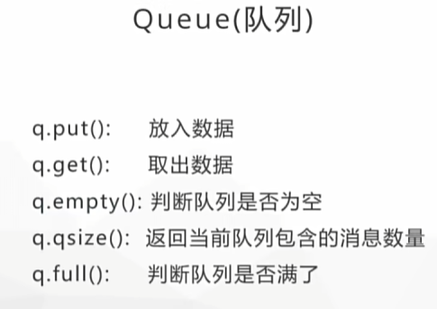

```
from queue import Queue

#初始化一个队列队形
q=Queue(3)  #最多可以接收三条消息，没写或者是负值就代表没有上限，直到内存的尽头
q. put("爱你到老")
q. put("你在做梦")
q. put("年轻人不讲武德")
print(q.qsize())
print (q.get())   #获取队列的一条消息，然后将其从队列中移除
print (q.get())
print (q.empty())
print (q.get())
print (q.empty())
```

#### **进程池**

进程池 = 管理多个进程的“进程管理器”

它负责：

1. 创建固定数量的子进程；
2. 把任务分配给空闲的子进程；
3. 子进程执行任务；
4. 任务完成后，子进程返回池中等待下一个任务。

|      | 普通Process  | 进程池Pool  |
| ---- | ---------- | -------- |
| 创建方式 | 手动创建       | 自动管理     |
| 进程数量 | 自己控制       | 固定数量     |
| 任务数量 | 通常一个进程一个任务 | 多个任务复用进程 |
| 资源消耗 | 较高         | 较低       |
| 适合   | 少量任务       | 大量重复任务   |

```
pool.apply_async(函数名, 参数)  #参数必须以元组形式传递
```

作用：

> 向进程池提交一个任务，让子进程执行。

```
from multiprocessing import Pool
import time

def work(num):
    print("正在执行任务", num)
    time.sleep(1)
    return num * num

if __name__ == '__main__':
    pool = Pool(3)   # 创建3个进程
    for i in range(5):
        pool.apply_async(work, (i,)) 
        #让进程池中的某一个空闲进程，异步执行函数 work，并把 i 作为参数传给 work。
    pool.close()
    pool.join()

    print("全部完成")
```

### **<mark>协程</mark>**

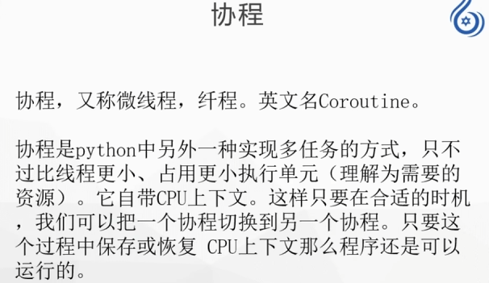

协程：单线程下的开发，又称为微线程，本质上还是一个线程

<u>注意：</u>线程和进程的操作是由程序触发系统接口，最后的执行者是系统，协程的操作则是程序员

应用场景：

1. 如果一个线程里面IO操作比较多的时候，可以用协程
   
   IO操作：Input/Output
   
   常见的IO操作：文件操作、网络请求

2. 适合高并发处理

```
import asyncio
async def work():  #定义协程函数
    print("开始执行")
    await asyncio.sleep(1)  #await 表示：等待某个操作完成，同时允许其他协程运行
    print("执行结束")
asyncio.run(work())
```

#### **greenlet**

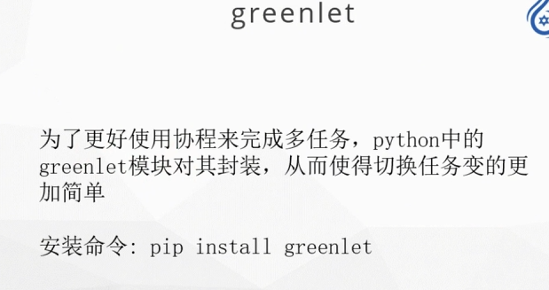

greenlet：是一个由c语言实现的协程模块。通过设置switch()来实现任意函数之间的切换
安装第三方模块
安装：pip install 模块名
卸载：pip uninstall 模块名
查看己安装的模块：pip list
<u>注意：</u>greenlet属于手动切换，当遇到IO操作，程序会阻塞，而不能进行自动切换

```
from greenlet import greenlet
def sing():
    print("在唱歌")
    print("唱完歌了")
def dance():
    print("在跳舞")
    print("跳完舞了")
# sing()
# dance()
if __name__ == "__main__":
    # 创建协程对象greenlet(任务名)
    g1 = greenlet(sing)
    g2 = greenlet(dance)
    g1.switch()
    g2.switch()
```

#### **gevent**

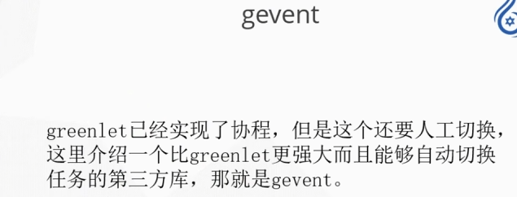

grevent：遇到IO操作时，会进行自动切换，属于主动式切换

<u>**注意：**</u>文件命名不要和第三方模块或内置模块重名

gevent.spawn(函数名)：创建协程对象

gevent.sleep()：耗时操作

gevent.ioin()：阻塞，等待某个协程执行结束

geven.joinall()：等待所有协程对象都执行结束再退出，参数是一个协程对象列表

```
import gevent

def sing():
    print("在唱歌")
    gevent.sleep(2)
    print("唱完歌了")
def dance():
    print("在跳舞")
    gevent.sleep(3)
    print("跳完舞了")
if __name__ == '__main__':
    #1.创建协程对象
    g1 = gevent.spawn (sing)   #这里创建协程对象就直接启动了，并准备运行
    g2 = gevent.spawn (dance)
    #2.阻塞，等待协程执行结束
    g1.join()  #g1结束完了，不会等g2
    #主程序执行完了，程序就结束了，没有join（）函数争取时间，协程就不会运行
    gevent.joinall([g1, g2])  #会等g1和g2都结束再退出
```

`time.sleep()` 会阻塞整个线程；`gevent.sleep()` 会主动让出协程执行权。

即time.sleep 是“我整个线程休息”；gevent.sleep 是“我这个协程休息，让别人先运行”。

monkey补丁：拥有在模块运行时替换的功能

monkey.patch_all()  #将用到的time.sleep()替换成gevent里面自己实现耗时操作的geven.sleep()代码

#### **总结**

线程是CPU调度的基本单位，进程是资源分配的基本单位

|         | 进程    | 线程           | 协程     |
| ------- | ----- | ------------ | ------ |
| 所属层级    | 程序    | 进程           | 线程     |
| 资源      | 独立    | 共享进程资源       | 共享线程资源 |
| 调度者     | 操作系统  | 操作系统         | 程序自己   |
| 切换速度    | 慢     | 中等           | 最快     |
| 资源消耗    | 最大    | 较小           | 最小     |
| 数量      | 较少    | 较多           | 很多     |
| 通信难度    | 高     | 低            | 低      |
| 利用多核CPU | 可以    | 受限制（Python中） | 不能     |
| 适合      | CPU密集 | IO密集         | 高并发IO  |

进程、线程、协程都是可以完成多任务的，可以根据自己实际开发的需要选择使用

### **<mark>正则基础</mark>**

#### **正则表达式**

字符串处理工具

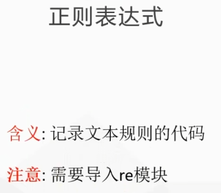

特点：

        语法比较复杂，可读性较差

        通用性很强，适用于多种编程语言

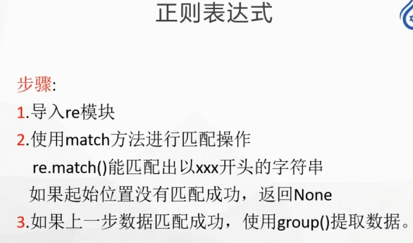

```
re.match(pattern,string,flags)
pattern匹配的正则表达式
string要匹配的字符串
```

```
import re

res=re.match("冰","冰可乐很爽")
print(res)
print(res.group())   #res.group()的作用是：获取正则匹配成功的内容（匹配到的字符串）
#注意：match是从开始位置匹配，匹配不到就没有，且匹配的是表达式整理
```

#### **匹配单个字符**

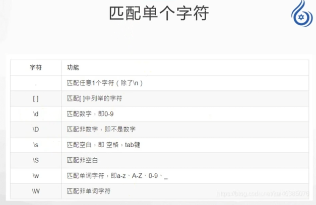

第一个字符是点（.）

\w还可以匹配汉字

\s\s表示1个tab

```
import re

#匹配1-5第一种写法
res=re.match("[1-5]","54237")
#匹配1-5第二种写法     #5
res=re.match("[12345]","54237")
print(res.group())   #5
```

#### **匹配多个字符**

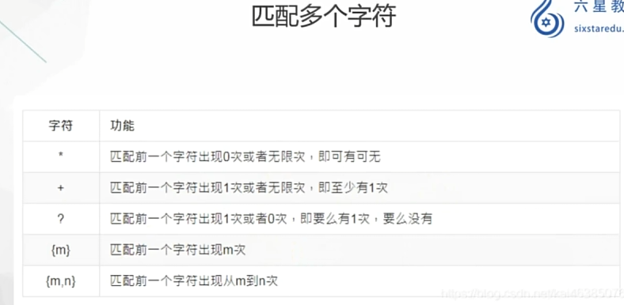

\*,+表示连续匹配的意思

```
import re

res=re.match(r"\d+","54237")
print(res.group())   #54237
```

{m}：连续匹配m个字符

```
import re

res=re.match(r"\d{3}","54237")
print(res.group())   #5
```

{m,n}:连续匹配最少m个，最多n个字符

```
import re

res=re.match(r"\w{3,5}","python")
print(res.group())   #pytho
```

#### **匹配开头结尾**

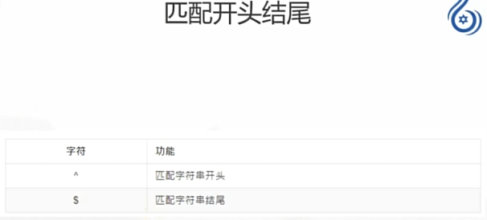

1.^：表示以...开头；表示对...取反

```
import re

res=re.match(r"^py","python")
print(res.group())   #py
```

<u>**注意：**</u>  ^在[]中表示不匹配

```
import re

res=re.match("[^py]","thon")
print(res.group())  #thon
```

2.\$：匹配字符串结尾

```
import re

res=re.match(".*$","python")
print(res.group())   #python
```

### **<mark>正则进阶</mark>**

#### **匹配分组**

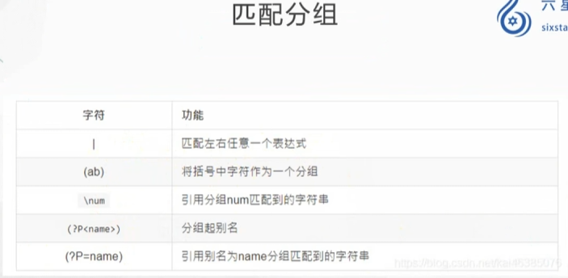

1.|：匹配左右任意一个表达式

```
import re

res=re.match("abc|deg","deg")
print(res.group())   #deg
```

2.（ab）：将括号中字符作为一个分组

```
import re

res=re.match(r"\w*@(163|qq|126).com","123@126.com")
print(res.group())  #123@126.com
```

3.`\num` = 在正则匹配过程中，要求当前位置再次匹配第 num 个括号分组之前匹配到的内容。

这里的 **num 是数字**，表示第几个括号分组，在正则表达式中，使用小括号 `()` 可以创建一个分组。

```
import re

s = "hello hello"
res = re.match(r"(\w+) \1", s)
print(res.group())   #hello hello
#组1 = hello，\1要求再次匹配：hello
```

4.（?p=name)和（?p<name)

```
import re

s = "abc abc"
res = re.match(r"(?P<word>\w+) (?P=word)", s)
print(res.group())   #abc abc
```

#### **高级用法**

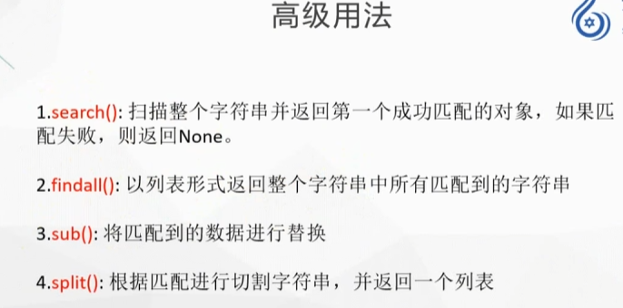

1.search():

```
import re

res=re.search(r"th","python")
print(res.group()) #th
```

2.findall():

```
import re

res=re.findall(r"th","pythonth")
print(res)   #['th', 'th']
```

3.sub():

```
#sub(patern,repl,string,count=替换的次数)
#pattern：正则表达式（代表需要被替换的，也就是字符串里面的旧内容）
#repl：新内容
#string：字符串
import re

res=re.sub(r"hello","bing",'hello python hello',count=2)
print(res)    #bing python bing
```

4.split():

```
#split(pattern,string,maxsplit=指定最大分割次数)
#pattern：正则表达式，即按这个正则表达式进行划分
#string：字符串
import re

res=re.split(",","hello,python,age,sex",maxsplit=2)
print(res)   #['hello', 'python', 'age,sex']
```

#### **贪婪与非贪婪**

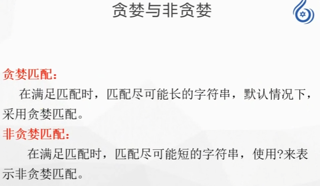

```
#贪婪匹配
import re

res=re.match("em*","emmmm")
print(res.group())   #emmmm

#非贪婪匹配
import re

res=re.match("em*?","emmmm")
print(res.group())  #e
```

#### **原生字符串**

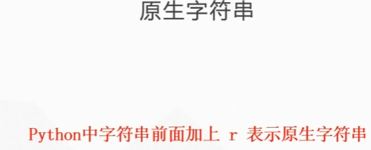

即r表示取消转义

```
import re

res=re.match(r"\\",r"\name")
print(res.group())   #\
```

| 目标              | 写法       |
| --------------- | -------- |
| 普通字符串表示一个 `\`   | `"\\"`   |
| 正则匹配一个 `\`（推荐）  | `r"\\"`  |
| 正则匹配一个 `\`（不用r） | `"\\\\"` |
| 原始字符串末尾单个 `\`   | ❌ `r"\"` |

### **<mark>内置模块</mark>**

所有模块都需要导入

#### **os模块**

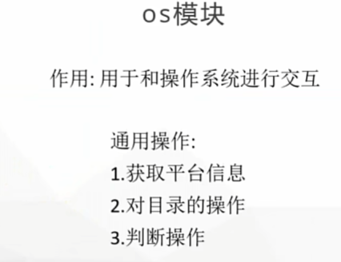

1. 获取平台信息
   
   os.name：指示正在使用的工作平台（返回操作系统类型）

```
import os

print(os.name)  #nt
#对于windows，返回nt，对于linux，返回posix
```

     os.getenv(环境变量名称)  #读取环境变量

```
import os

print(os.getenv("path"))
```

2. 对目录的操作

       os.path.split()  #把目录名和文件名分离，以元组的形式接收，第一个元素是目录路径，第二个元素是文件名

```
import os

print(os.path.split(r"D:\python\PythonProject1\main.py"))   
#('D:\\python\\PythonProject1', 'main.py')
```

      os.path.dirname    #显示split分割的第一个元素，即目录

      os.path.basename   #显示split分割的第二个元素，即文件名

```
import os

print(os.path.dirname(r"D:\python\PythonProject1\main.py"))  
#D:\python\PythonProject1
print(os.path.basename(r"D:\python\PythonProject1\main.py"))  
#main.py
#如果路径以/结尾，那么就返回空值，如果以\结尾，就会报错
```

3. 判度操作
   
   os.path.exists()  #判度路径（文件或目录）是否存在，存在的话就返回True，不存在就返回False

```
import os

print(os.path.exists(r"D:\python\PythonProject1\main.py"))  #True
```

        os.path.abspath()：获取当前路径下的绝对路径

```
import os

print(os.path.abspath(r"main.py"))  
#D:\python\PythonProject1\main.py
```

         os.path.isabs()：判度是否是绝对路径

```
import os

print(os.path.isabs(r"main.py"))    #False
```

#### **sys模块**

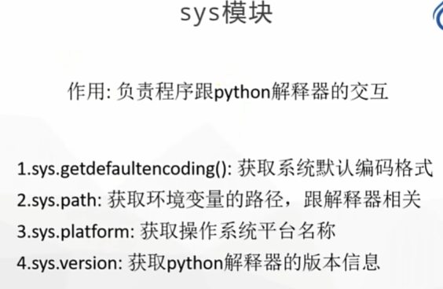

print(sys.path)：以列表的形式返回，第一项为当前所在的工作目录

#### **time模块**

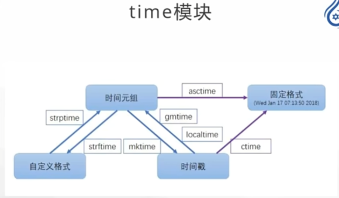

三种时间表示

1. 时间戳（timestamp）

2. 格式化的时间字符串（format time）

3. 时间元组（strut_time）

| 对比       | struct_time        | 时间戳 timestamp   |
| -------- | ------------------ | --------------- |
| 本质       | 一个时间结构体            | 一个数字            |
| 表示方式     | 年、月、日、时、分、秒等分开的数据  | 从某个时间点开始计算的秒数   |
| 可读性      | 人容易看懂              | 人不容易直接看懂        |
| 常见用途     | 显示、格式化时间           | 计算时间、比较时间       |
| Python类型 | `time.struct_time` | `float` 或 `int` |

具体函数

1. time,sleep()：延时操作，以秒为单位

2. time.time()：获取到当前的时间戳，以秒计算，从1970年1月1日00：00：00开始到现在的时间差

```
import time

print(type(time.time()))   #<class 'float'>，返回的是浮点数
```

3. time.localtime()：将一个时间戳转换为当前时区的struct_time

```
import time

print(time.localtime())  #是以元组的形式返回
```

4. time.asctime()：获取系统当前时间，把struct_time换成固定的字符串表达式

```
import time

print(time.asctime())   #Sun Jul 19 11:31:53 2026
```

5. time.ctime()：获取系统当前时间，把时间戳换成固定的字符串表达式

```
import time

print(time.ctime())   #Sun Jul 19 11:35:44 2026
```

6. time.strftime(格式化字符串,struct_time)：将struct_time转换成时间字符串

```
import time

print(time.strftime("%Y-%m-%d %H:%M:%S", time.localtime()))
```

Python 时间格式符号整理表：

| 格式符  | 含义                | 示例                       |
| ---- | ----------------- | ------------------------ |
| `%Y` | 四位年份              | 2026                     |
| `%y` | 两位年份              | 26                       |
| `%m` | 月份（01-12）         | 07                       |
| `%d` | 日（01-31）          | 19                       |
| `%H` | 小时（24小时制，00-23）   | 09                       |
| `%I` | 小时（12小时制，01-12）   | 09                       |
| `%M` | 分钟（00-59）         | 30                       |
| `%S` | 秒（00-59）          | 25                       |
| `%f` | 微秒（datetime支持）    | 123456                   |
| `%p` | 上午/下午             | AM / PM                  |
| `%a` | 星期英文缩写            | Sun                      |
| `%A` | 星期英文全称            | Sunday                   |
| `%w` | 星期数字（0-6，0表示星期日）  | 0                        |
| `%j` | 一年中的第几天（001-366）  | 200                      |
| `%U` | 一年中的第几周（周日作为一周开始） | 28                       |
| `%W` | 一年中的第几周（周一作为一周开始） | 29                       |
| `%c` | 本地日期和时间表示         | Sun Jul 19 09:30:25 2026 |
| `%x` | 本地日期表示            | 07/19/26                 |
| `%X` | 本地时间表示            | 09:30:25                 |
| `%z` | 时区偏移              | +0800                    |
| `%Z` | 时区名称              | CST                      |
| `%%` | 百分号 `%`           | %                        |

7. time.strptime(时间字符串,格式化字符串)：将时间字符串转化成struct_time

```
import time

print(time.strptime("2021-08-02", "%Y-%m-%d"))   
#time.struct_time(tm_year=2021, tm_mon=8, tm_mday=2, tm_hour=0, tm_min=0, tm_sec=0, tm_wday=0, tm_yday=214, tm_isdst=-1)
```

#### **logging模块**

作用：用于记录日志信息

日志的作用

1. 程序调试

2. 了解软件程序运行情况是否正常

3. 软件程序运行故障分析与定位

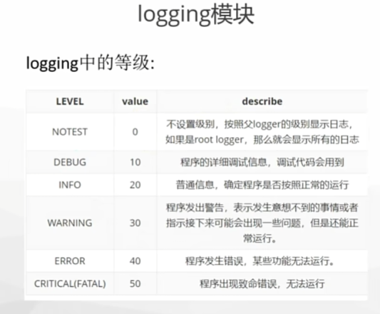

logging默认的level就是warning，也就是说logging只会显示级别大于等于warning的日志信息

```
import logging

logging.debug("我是debug")   #不显示
logging.warning("我是warning")    #WARNING:root:我是warning
```

logging.basicConfig()：配置root logger的参数

filename：指定日志文件的文件名，所有会显示的日志都会存放到这个文件中去

filemode：文件的打开方式，默认是a，追加模式

```
logging.basicConfig(filename='log.log',filemode='w')
#系统会创建一个log.log的文件，并把日志信息都放入这个文件中，这个文件的打开方式为只写
```

level：指定日志显示级别，默认是警告信息warning

```
logging.basicConfig(filename='log.log',filemode='w',level=logging.NOTSET)
#可以指定写入日志的显示级别
```

format：指定日志信息的输出格式

logging 常用格式符号表

| 格式符                   | 含义               | 示例                      |
| --------------------- | ---------------- | ----------------------- |
| `%(asctime)s`         | 日志产生时间           | 2026-07-19 10:20:30,123 |
| `%(levelname)s`       | 日志级别名称           | INFO、WARNING、ERROR      |
| `%(levelno)s`         | 日志级别数字           | 20、30、40                |
| `%(message)s`         | 日志信息内容           | 用户登录成功                  |
| `%(name)s`            | Logger名称         | root                    |
| `%(filename)s`        | 文件名              | test.py                 |
| `%(module)s`          | 模块名（不含.py）       | test                    |
| `%(pathname)s`        | 文件完整路径           | D:/project/test.py      |
| `%(lineno)d`          | 日志所在行号           | 25                      |
| `%(funcName)s`        | 函数名称             | login                   |
| `%(thread)d`          | 线程ID             | 12345                   |
| `%(threadName)s`      | 线程名称             | MainThread              |
| `%(process)d`         | 进程ID             | 5678                    |
| `%(processName)s`     | 进程名称             | MainProcess             |
| `%(created)f`         | 日志创建时间戳          | 1784443230.123          |
| `%(relativeCreated)d` | logging启动后经过的毫秒数 | 5230                    |
| `%(msecs)d`           | 毫秒部分             | 123                     |

```
import logging

logging.basicConfig(
    level=logging.DEBUG,
    format="%(asctime)s %(levelname)s %(filename)s:%(lineno)d %(message)s"
)

logging.info("程序启动")  
logging.error("数据库连接失败")   
#2026-07-19 10:30:20,100 INFO main.py:8 程序启动
2026-07-19 10:30:20,101 ERROR main.py:9 数据库连接失败
```

#### **random模块**

作用：用于实现各种分布的伪随机数生成器，可以根据不同的实数分布来生成随机生成值


4.step：指定产生随机的步长，随机选择一个数据   

例如start：2，stop：7，step：2，那么产生的随机数只能是2，4，6（从2开始以步长递增）

## **<mark>python补充知识点</mark>**

"连接符".join(可迭代对象)：使用指定的字符串，把多个字符串连接起来。

```
a = ["python", "java", "c++"]
print(",".join(a))  
#python,java,c++
```

`str(i)` 的意思是：

> **把变量 `i` 转换成字符串（string）类型**

### <mark>**常见字符串大小写转换方法总结**</mark>

| 方法             | 作用        | 示例                                        |
| -------------- | --------- | ----------------------------------------- |
| `upper()`      | 全部转大写     | `"abc".upper()` → `"ABC"`                 |
| `lower()`      | 全部转小写     | `"ABC".lower()` → `"abc"`                 |
| `capitalize()` | 首字母大写     | `"hello".capitalize()` → `"Hello"`        |
| `title()`      | 每个单词首字母大写 | `"hello world".title()` → `"Hello World"` |
| `swapcase()`   | 大小写互换     | `"aB".swapcase()` → `"Ab"`                |

日常 Python 编程中，**字符串大小写转换直接使用 `upper()` 和 `lower()` 即可**。
